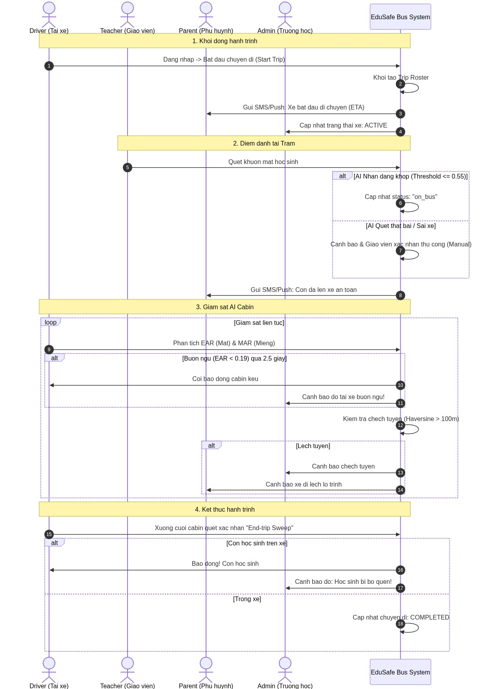
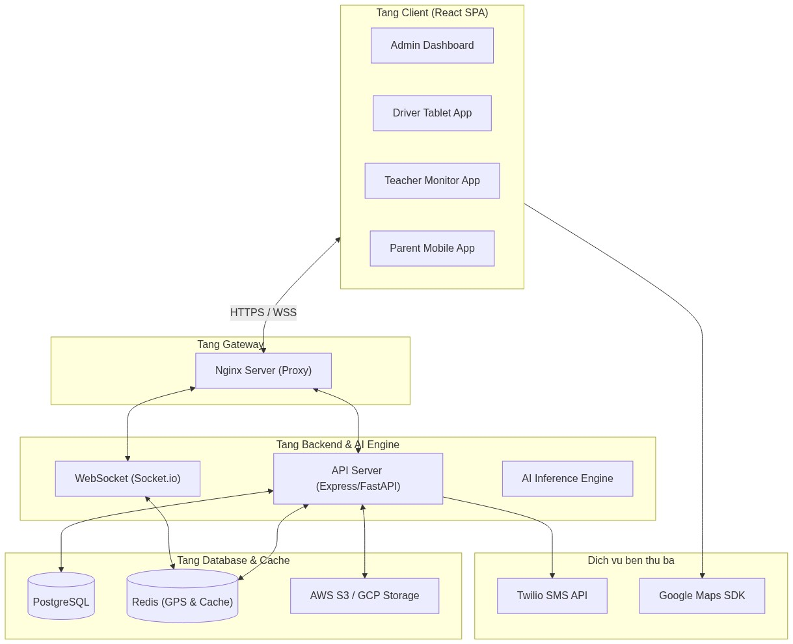
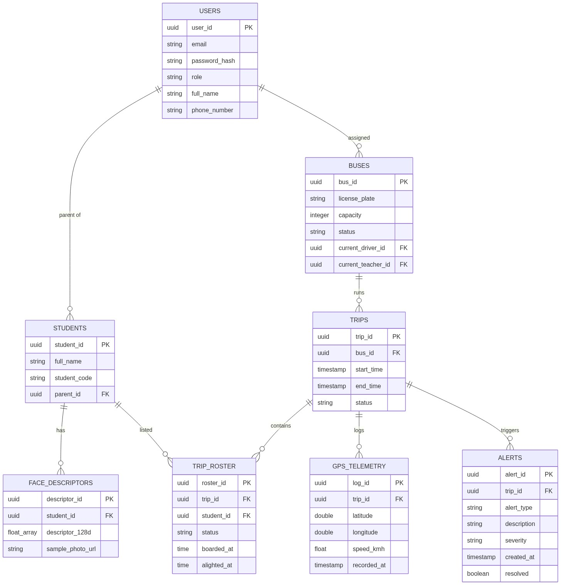

# BÁO CÁO DỰ ÁN MVP - EDUSAFE BUS

## PHẦN II. KIẾN TRÚC SẢN PHẨM VÀ MVP

### 2.1. Đặc tả sản phẩm MVP – MVP Specification

#### a. Danh sách tính năng cốt lõi – Core Features
Phiên bản MVP của **EduSafe Bus** giải quyết triệt để 3 "nỗi đau" (pain points) cốt lõi của khách hàng (nhà trường, phụ huynh và đơn vị vận hành xe đưa đón):
1. **Rủi ro bỏ quên học sinh trên xe** (Nỗi đau lớn nhất dẫn đến các tai nạn thương tâm).
2. **Tài xế mất tập trung, ngủ gật hoặc gặp vấn đề sức khỏe đột xuất** trong quá trình vận hành.
3. **Xe đi chệch lộ trình đăng ký, trễ giờ đón/trả** mà không có sự thông báo kịp thời.

Dưới đây là danh sách các tính năng đã được lập trình, tối ưu hóa và hoàn thiện trong phiên bản MVP:

| Tên tính năng cốt lõi | Mô tả chi tiết kỹ thuật trong MVP | Nỗi đau giải quyết |
| :--- | :--- | :--- |
| **Hệ thống điểm danh AI Edge (Face Recognition)** | Sử dụng thư viện `face-api.js` trực tiếp dưới Client để trích xuất Vector đặc trưng 128 chiều (`128-D descriptor`). Đối khớp khuôn mặt qua khoảng cách Euclid với ngưỡng threshold `0.55`. Tự động cập nhật trạng thái học sinh thành `on_bus` (lên xe) hoặc `alighted` (xuống xe). | Đảm bảo điểm danh chính xác tại điểm đón/trả mà không phụ thuộc vào thẻ từ dễ mất hoặc nhập tay thủ công. |
| **Cơ chế xác nhận thủ công (Manual Fallback Roster)** | Giao diện Giáo viên hỗ trợ ghi đè trạng thái điểm danh thủ công trong trường hợp ánh sáng yếu, học sinh đeo khẩu trang/kính hoặc AI quét nhầm. Hệ thống lưu lại nhật ký chỉnh sửa rõ ràng. | Giải quyết tính bất định của công nghệ AI trong điều kiện vận hành thực tế kém lý tưởng. |
| **Lõi giám sát cabin & phát hiện buồn ngủ (Drowsiness Engine)** | Phân tích luồng camera của tài xế thông qua chỉ số **EAR (Eye Aspect Ratio)** (ngưỡng nhắm mắt `< 0.19`) và **MAR (Mouth Aspect Ratio)** (ngáp mệt mỏi `> 0.55`). Tích hợp thuật toán **Noisy-OR Bayesian Fusion** để cộng dồn điểm rủi ro và phát âm thanh cảnh báo trực tiếp (beep liên hồi) khi nhắm mắt quá 2.5s. | Ngăn ngừa tai nạn giao thông do tài xế ngủ gật, mệt mỏi hoặc mất tập trung. |
| **Rà soát khoang xe cuối hành trình (End-trip Cabin Sweep)** | Buộc tài xế phải bấm nút bắt đầu và hoàn thành việc đi xuống cuối xe quét xác nhận trạng thái trống của xe. Hệ thống kiểm tra chéo với cơ sở dữ liệu học sinh còn trên xe (`still_on_bus`). | Loại bỏ hoàn toàn khả năng học sinh bị ngủ quên hoặc bỏ sót lại trên xe khi xe đã về bãi đỗ. |
| **Định vị GPS & Thuật toán lệch tuyến Haversine** | Mô phỏng tọa độ GPS thời gian thực. Sử dụng thuật toán chiếu vector vuông góc từ GPS hiện tại lên lộ trình chuẩn gồm tập hợp các Waypoints. Nếu khoảng cách sai lệch vượt quá ngưỡng `100m` (hoặc `150m`), hệ thống lập tức kích hoạt cảnh báo lệch tuyến. | Ngăn ngừa xe đi sai tuyến, bắt cóc, hoặc tài xế tự ý thay đổi lộ trình mà không được phê duyệt. |
| **Ma trận Nút bấm khẩn cấp SOS đa kênh** | Kích hoạt hệ thống gửi tin nhắn khẩn cấp, đẩy thông báo qua WebSocket đến Admin/Giáo viên/Phụ huynh đồng thời với độ trễ `< 1 giây` khi bấm nút SOS. | Hỗ trợ xử lý khủng hoảng lập tức khi xe xảy ra va chạm, hỏa hoạn hoặc tài xế gặp đột quỵ đột ngột. |

---

#### b. Luồng người dùng và thiết kế trải nghiệm – User Flow & UX/UI

##### Sơ đồ luồng thao tác của người dùng trên hệ thống (Mermaid Sequence)
Dưới đây là mô tả luồng giao tiếp tương tác đa bên thời gian thực của hệ thống:



##### Đánh giá những cải tiến về UX/UI so với bản thiết kế mockup tại Vòng 2
Khi chuyển đổi từ bản thiết kế tĩnh (mockup) tại Vòng 2 sang ứng dụng lập trình thực tế, đội thi đã thực hiện các cải tiến quan trọng về UX/UI để đảm bảo tính khả dụng trong môi trường chuyển động và áp lực thời gian:

*   **Thiết kế Glassmorphism & Dark Mode tương phản cao**: Thay vì sử dụng giao diện màu sáng thông thường, hệ thống áp dụng giao diện tối (`var(--bg-dark)`) kết hợp các bảng điều khiển dạng kính bán trong suốt (`glass-panel`). Điều này giúp tài xế giảm mỏi mắt khi lái xe ban đêm và dễ dàng nhìn thấy các chỉ số cảnh báo dưới ánh sáng mặt trời ban ngày.
*   **Trực quan hóa chỉ số sinh trắc học thời gian thực (Live AI Telemetry)**: Giao diện Tablet của tài xế không chỉ báo động khi có sự cố mà còn hiển thị liên tục biểu đồ biến thiên của chỉ số `EAR` (Eye Aspect Ratio), `MAR` (Mouth Aspect Ratio) và độ nghiêng đầu `Pitch` thông qua thanh đo trực quan. Tài xế biết rõ trạng thái mệt mỏi của mình để chủ động điều chỉnh.
*   **Thiết kế nút bấm SOS và hành động lớn kích thước tối thiểu 44x44px**: Đảm bảo các tương tác khẩn cấp (nút bấm SOS, nút xác nhận thủ công của giáo viên, nút xác nhận rà soát khoang xe) có kích thước lớn, dễ thao tác trong điều kiện xe đang rung lắc dữ dội.
*   **Tích hợp Bảng điều khiển thử nghiệm AI (AI Specs Developer Drawer)**: Cung cấp khu vực hiển thị cấu trúc dữ liệu JSON và log hệ thống trực quan, hỗ trợ đội ngũ phát triển và BGK dễ dàng theo dõi cách các thuật toán AI đang hoạt động ngầm (WebSockets payloads, Vector descriptors).

---

### 2.2. Thiết kế hệ thống và cơ sở dữ liệu – System & Database Design

#### a. Sơ đồ kiến trúc hệ thống – System Architecture Diagram
Hệ thống được thiết kế theo kiến trúc Microservices hướng sự kiện (Event-Driven Architecture) nhằm đảm bảo thông báo cảnh báo được gửi đi tức thời:



*Mô tả luồng giao tiếp:*
1. **Client (React SPA)** giao tiếp với server thông qua giao thức HTTPS (yêu cầu dữ liệu tĩnh, cấu hình) và WSS (WebSockets) để truyền nhận tọa độ xe và tín hiệu cảnh báo buồn ngủ/chệch hướng theo thời gian thực.
2. **WebSocket Server (Socket.io)** lưu trữ trạng thái kết nối và vị trí hiện tại của các xe đang hoạt động trực tiếp vào **Redis Cache** nhằm đảm bảo tốc độ phản hồi nhanh nhất.
3. **Database chính (PostgreSQL)** lưu trữ dữ liệu có cấu trúc có tính toàn vẹn cao (thông tin học sinh, phân quyền tài khoản, lịch trình chạy xe, danh sách điểm danh).
4. Khi phát sinh sự kiện nguy hiểm (SOS), backend đẩy tin nhắn vào hàng đợi **RabbitMQ**, từ đó kích hoạt service gửi tin nhắn SMS khẩn cấp qua **Twilio** đến số điện thoại khẩn cấp đã đăng ký.

---

#### b. Thiết kế cơ sở dữ liệu – ERD (Entity Relationship Diagram)
Cấu trúc lưu trữ dữ liệu được thiết kế trên hệ quản trị cơ sở dữ liệu quan hệ **PostgreSQL** để duy trì ràng buộc chặt chẽ giữa học sinh, phụ huynh, chuyến xe và phương tiện:



*Tính hợp lý và tối ưu của thiết kế:*
*   **Tránh dư thừa dữ liệu**: Thông tin định danh học sinh và vector khuôn mặt được lưu tách biệt. Bảng `FACE_DESCRIPTORS` lưu trữ mảng float 128 chiều giúp thuật toán đối khớp nhanh chóng tải lên bộ nhớ RAM của server hoặc client để tính toán khoảng cách Euclid.
*   **Tách biệt dữ liệu thời gian thực**: Tọa độ GPS liên tục ghi nhận được đưa vào bảng riêng `GPS_TELEMETRY`. Trên môi trường thực tế, bảng này có thể áp dụng cơ chế phân vùng dữ liệu (Partitioning) theo ngày/tháng hoặc chuyển sang lưu trữ Time-Series database (như TimescaleDB) để tối ưu hóa truy vấn vẽ lại hành trình.
*   **Quản lý trạng thái chuyến đi chặt chẽ**: Bảng trung gian `TRIP_ROSTER` cho phép theo dõi lịch sử lên xuống của từng học sinh trong từng chuyến đi cụ thể, phục vụ cho việc đối soát và báo cáo sau này.

---

### 2.3. Hạ tầng công nghệ và triển khai – Tech Stack & Deployment

#### a. Công nghệ sử dụng
Hệ thống sử dụng các công nghệ hiện đại, đảm bảo hiệu năng và khả năng mở rộng:

*   **Frontend**: 
    *   **ReactJS** (sử dụng **Vite** để tối ưu hóa tốc độ build dự án).
    *   **Vanilla CSS3** (sử dụng thiết kế Responsive Grid, Custom Properties để quản lý mã màu đồng bộ).
    *   **Lucide React** hệ thống icons trực quan, tối giản.
    *   **face-api.js** chạy trực tiếp các mô hình AI trên trình duyệt Client (Edge Computing) giúp giảm tải xử lý đồ họa cho server.
*   **Backend** *(Mô hình đề xuất cho sản xuất)*:
    *   **Node.js / Express** (xử lý API nghiệp vụ, quản lý phân quyền) hoặc **Python FastAPI** (xử lý luồng tính toán AI, tối ưu hóa đa tiến trình).
    *   **Socket.io** quản lý kết nối WebSocket hai chiều.
*   **Database & Caching**:
    *   **PostgreSQL** làm cơ sở dữ liệu quan hệ lưu trữ dữ liệu nghiệp vụ chính.
    *   **Redis** lưu trữ Session người dùng và vị trí GPS tức thời để giảm tải trực tiếp cho PostgreSQL.
*   **Thư viện/Thuật toán hỗ trợ**:
    *   **Haversine Formula**: Thuật toán tính khoảng cách địa lý giữa 2 điểm GPS.
    *   **Simple Moving Average (SMA) Filter**: Bộ lọc trung bình trượt giúp khử nhiễu tín hiệu GPS nhận về từ thiết bị di động/tablet.

---

#### b. Quy trình triển khai – Deployment & DevOps

##### Đóng gói ứng dụng bằng Docker & Docker Compose
Ứng dụng đã được thiết lập sẵn quy trình đóng gói qua Dockerfile (sử dụng quy trình Multi-stage build để giảm thiểu dung lượng ảnh Docker xuống mức tối đa) và chạy cùng Nginx để phục vụ file tĩnh một cách bảo mật:

```dockerfile
# Stage 1: Build source code React
FROM node:20-alpine AS build
WORKDIR /app
COPY package*.json ./
RUN npm install
COPY . .
RUN npm run build

# Stage 2: Serve static files with Nginx
FROM nginx:alpine
COPY nginx.conf /etc/nginx/nginx.conf
COPY --from=build /app/dist /usr/share/nginx/html
EXPOSE 8080
CMD ["nginx", "-g", "daemon off;"]
```

Cấu hình khởi chạy nhanh chóng với Docker Compose:
```yaml
version: '3.8'
services:
  web:
    build: .
    ports:
      - "8080:8080"
    restart: always
    environment:
      - NODE_ENV=production
```

##### Quy trình triển khai Cloud & CI/CD
*   **Phương án Host Tĩnh (Client-only)**: Deploy trực tiếp lên **Netlify** hoặc **Vercel** thông qua việc liên kết nhánh chính (`main`/`cheese`) của kho chứa mã nguồn GitHub. Netlify tự động kích hoạt luồng build và deploy khi có thay đổi code mới.
*   **Phương án Cloud Server (Fullstack)**:
    *   Sử dụng VPS của **AWS (EC2)** hoặc **GCP (Compute Engine)** hệ điều hành Ubuntu Server.
    *   Cài đặt **Docker & Docker Compose**.
    *   Thiết lập **GitHub Actions** tự động: Khi lập trình viên push code lên nhánh chính, GitHub Actions sẽ tự động chạy lint kiểm tra lỗi, build Docker Image, đẩy lên DockerHub, sau đó SSH vào VPS để kéo (`docker pull`) và tái khởi động container (`docker-compose up -d`).
    *   Cấu hình chứng chỉ bảo mật **SSL Let's Encrypt** (HTTPS) tự động bằng Certbot trên Nginx.

---

#### c. Tích hợp nâng cao
Hệ thống EduSafe Bus tích hợp sâu các thuật toán AI và dịch vụ bên thứ ba để tối ưu hóa sự an toàn:

1.  **Ứng dụng AI Edge (AI chạy trên thiết bị đầu cuối)**:
    *   **Face Recognition**: Load trực tiếp 3 mô hình của `face-api.js` gồm: `tinyFaceDetector` (phát hiện khuôn mặt nhanh), `faceLandmark68Net` (xác định 68 điểm mốc khuôn mặt), và `faceRecognitionNet` (trích xuất vector đặc trưng khuôn mặt). Việc chạy AI trực tiếp dưới Client giúp hệ thống hoạt động mượt mà ngay cả khi kết nối mạng chập chờn.
    *   **Drowsiness Detection**: Tính toán khoảng cách chớp mắt để đưa ra chỉ số `EAR`. Nếu nhắm mắt liên tục trong thời gian dài kết hợp ngáp (`MAR > 0.55`), thuật toán **Bayesian Noisy-OR Fusion** tích lũy rủi ro để đưa ra các mức cảnh báo tương ứng (Cấp 1: Cảnh báo nhẹ, Cấp 2: Phát còi Cabin, Cấp 3: Gửi báo động về trung tâm).
2.  **Thuật toán tối ưu hóa tuyến đường**:
    *   Áp dụng thuật toán chiếu vector khoảng cách từ điểm GPS của xe xuống đoạn thẳng nối giữa 2 Waypoints liên tiếp trên bản đồ lộ trình. Điều này hiệu quả hơn việc chỉ tính khoảng cách đơn thuần tới các Waypoint tĩnh, giúp giảm thiểu sai số báo động giả khi xe đi qua khúc cua lớn.
3.  **Tích hợp API của bên thứ ba**:
    *   **Twilio SMS / SendGrid Email**: Dùng để tự động kích hoạt gửi tin nhắn SMS, Email cho Phụ huynh và BGH trường khi xảy ra sự kiện khẩn cấp (nhấn SOS hoặc phát hiện học sinh bị bỏ quên).
    *   **Mapbox API / Google Maps SDK**: Cung cấp giao diện bản đồ trực quan, tính toán đường đi tối ưu và thời gian dự kiến đến nơi (ETA).

---

### 2.4. Quản lý chất lượng và bảo mật – QA & Security

Đối với sản phẩm EdTech và giám sát an toàn học sinh như EduSafe Bus, bảo mật thông tin và quyền riêng tư là ưu tiên hàng đầu. Phương án bảo vệ dữ liệu gồm:

*   **Xác thực người dùng (Authentication)**:
    *   Sử dụng cơ chế mã hóa mật khẩu một chiều mạnh mẽ với thuật toán **bcrypt** trước khi lưu vào database.
    *   Sử dụng **JSON Web Token (JWT)** có thời gian hết hạn ngắn để quản lý phiên đăng nhập của người dùng. Token được lưu trữ bảo mật dưới Client bằng `HttpOnly Cookie` để chống lại các cuộc tấn công XSS (Cross-Site Scripting).
*   **Phân quyền truy cập (Role-based Access Control - RBAC)**:
    *   Hệ thống kiểm tra phân quyền nghiêm ngặt ở cả 2 đầu Client và API Backend.
    *   *Admin*: Xem báo cáo, cấu hình xe, phân công tuyến đường cho tài xế và giáo viên.
    *   *Lái xe (Driver)*: Chỉ truy cập màn hình giám sát cabin, bản đồ tuyến xe được phân công và thực hiện kiểm tra khoang xe cuối hành trình.
    *   *Giáo viên (Teacher)*: Chỉ truy cập giao diện điểm danh và gửi tín hiệu SOS từ xe của mình quản lý.
    *   *Phụ huynh (Parent)*: Chỉ được xem thông tin định vị và lịch sử lên xuống của đúng con em mình đăng ký, không có quyền truy cập thông tin các học sinh khác trên xe.
*   **Bảo vệ dữ liệu & Quyền riêng tư của học sinh**:
    *   **Mã hóa dữ liệu nhạy cảm**: Mã hóa thông tin cá nhân của học sinh trong database.
    *   **Bảo mật hình ảnh**: Hình ảnh khuôn mặt của học sinh sau khi đăng ký sẽ được xử lý trích xuất thành mảng Vector số đặc trưng và lưu trữ dưới dạng mảng byte. Hệ thống KHÔNG cần lưu trữ hình ảnh gốc của học sinh trên server Cloud để giảm thiểu rủi ro rò rỉ hình ảnh cá nhân của trẻ em (tuân thủ tinh thần đạo luật bảo vệ quyền riêng tư của trẻ em COPPA).
*   **An toàn thông tin trong vận hành**:
    *   Kích hoạt HTTPS (TLS 1.3) và WSS cho toàn bộ kết nối truyền tải để ngăn chặn các cuộc tấn công nghe lén (Man-in-the-middle).
    *   Cấu hình chính sách bảo mật nội dung **CORS (Cross-Origin Resource Sharing)** trên API Server để chỉ cho phép Client được ủy quyền gửi request.

---

### 2.5. Trải nghiệm MVP thực tế

#### a. Đường dẫn trải nghiệm MVP
*   **Địa chỉ Website trải nghiệm trực tiếp**: [https://edusafe-bus.netlify.app](https://edusafe-bus.netlify.app) *(Nhóm có thể thay đổi bằng URL thực tế sau khi deploy)*
*   **Mã nguồn dự án (GitHub)**: [https://github.com/Mindoongie/RedVelvet](https://github.com/Mindoongie/RedVelvet)
*   **Video Demo hoạt động thực tế (Thời lượng dưới 3 phút)**: [Liên kết Video Demo Youtube/Drive tại đây] *(Đội thi cần chèn link video thực tế)*

---

#### b. Tài khoản thử nghiệm
Hệ thống tự động nhận diện vai trò dựa trên email khi đăng nhập và hiển thị đúng giao diện chuyên biệt của vai trò đó. Ban Giám khảo có thể đăng nhập bằng các tài khoản demo sau để đánh giá:

| Phân quyền (Role) | Email đăng nhập | Mật khẩu | Chức năng kiểm thử chính |
| :--- | :--- | :--- | :--- |
| **Admin Trường** | `admin@edusafe.edu.vn` | `admin123` | Theo dõi tổng quan đội xe, xem bản đồ GPS tích hợp cảnh báo lệch tuyến, xem nhật ký cảnh báo AI. |
| **Lái Xe Bus** | `driver.hung@edusafe.edu.vn` | `driver123` | Trải nghiệm giao diện Tablet trong cabin, bật/tắt camera để mô phỏng giám sát buồn ngủ (EAR/MAR), thực hiện quy trình "End-trip Cabin Sweep". |
| **Giáo Viên** | `teacher.thu@edusafe.edu.vn` | `teacher123` | Quét điểm danh khuôn mặt học sinh lúc lên/xuống xe, thực hiện việc xác nhận thủ công (Manual override). |
| **Phụ Huynh** | `parent.chi@edusafe.edu.vn` | `parent123` | Theo dõi vị trí xe thời gian thực của con mình, nhận thông báo đẩy và đăng ký dữ liệu khuôn mặt cho con (chụp ảnh & trích xuất vector AI). |

---

### 💡 Lưu ý dành cho đội thi trước khi nộp báo cáo:
Để báo cáo hoàn hảo nhất, vui lòng bổ sung các thông tin sau:
1.  **Đường dẫn Video Demo**: Cần quay một clip dài tối đa 3 phút mô tả: cảnh Giáo viên quét điểm danh học sinh, cảnh Tài xế nhắm mắt buồn ngủ còi hú cảnh báo, và cảnh Admin nhận cảnh báo lệch tuyến. Sau đó tải lên Youtube/Google Drive ở chế độ công khai và chèn link vào phần **2.5.a**.
2.  **Đường dẫn Web đã deploy chính thức**: Nếu nhóm có cập nhật tên miền phụ trên Netlify khác với `edusafe-bus.netlify.app`, hãy cập nhật chính xác đường dẫn này vào mục **2.5.a**.
