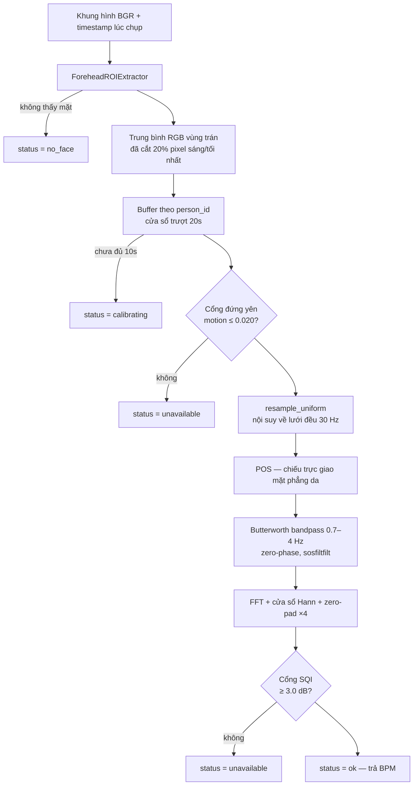

# Báo cáo tổng kết kỹ thuật — Module rPPG (Heart_rate)

**Ngày:** 28/07/2026 · **Nhánh:** `cuce` · **Phạm vi:** toàn bộ thư mục `Heart_rate/` (8 file, ~1.400 dòng)

---

## 1. Tóm tắt điều hành

Module đo nhịp tim không tiếp xúc (remote photoplethysmography — rPPG) từ camera thường, thiết kế cho bối cảnh giám sát người trong xe khi xe đứng yên.

**Kết luận:** phần lõi thuật toán **đã hoàn thiện và được kiểm chứng**. Toàn bộ 14 kiểm tra tự động đều ĐẠT, sai số khôi phục nhịp tim < 0,35 BPM trên dải 48–140 BPM với tín hiệu tổng hợp đúng thang thực tế (biên độ mạch 0,6 % mức DC). Kiến trúc tách tầng sạch, hợp đồng giao diện rõ ràng, và — điểm mạnh nhất — hệ thống **từ chối trả số khi không đủ tin cậy** thay vì đoán bừa.

**Chưa xong:** tài liệu hướng dẫn đã bổ sung nhưng ngưỡng vẫn chưa hiệu chỉnh trên dữ liệu thật, và một số khẳng định trong docstring (an toàn đa luồng, hỗ trợ nhiều người) chưa được mã nguồn bảo đảm.

> **Cập nhật 28/07/2026 — đã dựng chạy được trên local.** Các mục chặn V1, V2, V9 đã xử lý: tách package `rppg/`, thêm `__init__.py`, viết README, sửa lỗi encoding console Windows. Chi tiết ở §9.

| Hạng mục | Trạng thái |
|---|---|
| Thuật toán lõi (POS → lọc → FFT → SQI) | ✅ Hoàn thiện, có kiểm chứng định lượng |
| Cơ chế cổng chất lượng (SQI + motion gate) | ✅ Hoạt động đúng, tách biệt 12,3 dB giữa tín hiệu và nhiễu |
| Trích xuất ROI (3 backend + fallback) | ✅ Có, chưa có test tự động |
| Hiệu năng | ✅ 12,9 ms/lần tính, ~2,6 % một lõi CPU |
| Đóng gói / import được | ✅ **Đã sửa** — package `rppg/`, chạy `python demo.py` trực tiếp |
| Tài liệu cài đặt & sử dụng | ✅ **Đã sửa** — README đầy đủ + 2 tài liệu kỹ thuật |
| Hiệu chỉnh trên dữ liệu thật | ❌ Chưa có, ngưỡng còn là giá trị khởi điểm |
| An toàn đa luồng / đa người | ⚠️ Docstring khẳng định nhưng mã chưa bảo đảm |

---

## 2. Kiến trúc

### 2.1 Phân tầng

```
demo.py              Giao diện trực quan, ghi video, panel phổ tần số
   │
monitor.py           API tích hợp — PulseMonitor.process_frame()
   │                 Buffer theo person_id, TTL, cổng gating, điều phối
   ├── face_roi.py   Trích ROI vùng trán → giá trị trung bình RGB
   ├── algorithms.py Hàm thuần: resample → POS → bandpass → FFT → SQI
   ├── config.py     Toàn bộ hằng số hệ thống, một chỗ duy nhất
   └── camera.py     Mở camera, khóa auto-exposure / auto-WB
```

Điểm thiết kế tốt nhất: **`algorithms.py` không phụ thuộc camera, không phụ thuộc MediaPipe, không giữ trạng thái**. Toàn bộ là hàm thuần. Nhờ vậy `test_algorithms.py` kiểm chứng được thuật toán bằng tín hiệu tổng hợp có nhịp tim đã biết trước — không cần phần cứng, không cần người thật. Đây là điều kiện tiên quyết để biết con số trả về là đo được hay là ảo.

### 2.2 Luồng dữ liệu



---

## 3. Chi tiết kỹ thuật từng tầng

### 3.1 Trích xuất ROI — [face_roi.py](Heart_rate/rppg/face_roi.py)

**Vùng trán** được chọn làm ROI qua 14 landmark bao quanh trên lưới 468 điểm của MediaPipe Face Mesh ([face_roi.py:27-30](Heart_rate/rppg/face_roi.py#L27-L30)). Đây là lựa chọn đúng: trán phẳng, ít cơ vận động khi nói/biểu cảm, mật độ mao mạch cao.

**Ba backend xếp tầng** ([face_roi.py](Heart_rate/rppg/face_roi.py)):
1. `mediapipe.solutions.face_mesh` — API cũ, không cần tải model
2. `mediapipe.tasks.FaceLandmarker` — API mới, cần file `.task`
3. OpenCV Haar cascade — luôn có sẵn, kém chính xác, dùng khi bí

Lý do làm cả ba (nêu trong docstring): các phiên bản MediaPipe expose API khác nhau, trong nhóm nhiều người gần như chắc chắn sẽ lệch phiên bản. Đây là quyết định kỹ thuật thực dụng và đúng.

> **Quyết định này đã tự chứng minh giá trị.** MediaPipe 0.10.35 (bản cài thực tế, vẫn thỏa ràng buộc `>=0.10,<0.11` trong `requirements.txt`) đã **bỏ hẳn `mp.solutions`** — module chỉ còn `Image`, `ImageFormat`, `tasks`. Backend 1 vì vậy chết trên môi trường hiện tại. Nhờ có cơ chế xếp tầng, hệ thống tự rơi xuống Backend 2 mà không cần sửa dòng nào. Nếu chỉ cài đặt một backend duy nhất thì module đã hỏng hoàn toàn sau một lần nâng phiên bản phụ.
>
> Hệ quả thực tế: **Backend 2 giờ là đường chính, không còn là dự phòng.** Nó cần một file model rời, nên đã bổ sung `rppg/download_model.py` và cơ chế tự tìm model — xem §9.

**Cắt tỉa theo phần trăm** ([face_roi.py:48-78](Heart_rate/rppg/face_roi.py#L48-L78)): loại 10 % pixel tối nhất và 10 % sáng nhất trước khi lấy trung bình, xếp hạng theo độ sáng tổng để **giữ nguyên tương quan giữa ba kênh** — chi tiết này quan trọng, vì POS làm việc trên tỉ lệ giữa các kênh. Mục đích loại tóc mái, chân tóc, gọng kính, bóng đổ.

**Ba cổng loại mẫu xấu** ([face_roi.py:247-261](Heart_rate/rppg/face_roi.py#L247-L261)): ROI < 200 px, ROI quá tối (trung bình < 15), ROI cháy sáng (đỉnh > 250). Mẫu bão hòa đã bị cắt cụt thông tin biến thiên nên không thể cứu ở tầng sau.

Ngoài ra mask được `erode` 5×5 ([face_roi.py:228](Heart_rate/rppg/face_roi.py#L228)) để co vào trong, tránh dính chân tóc ở rìa đa giác.

### 3.2 Resample theo timestamp — [algorithms.py:22-75](Heart_rate/rppg/algorithms.py#L22-L75)

**Đây là tầng có giá trị kỹ thuật cao nhất trong toàn module**, và cũng là bước hay bị bỏ qua nhất trong các cài đặt rPPG khác.

Webcam chạy variable frame rate. Nếu giả định "fps cố định", trục thời gian bị co giãn, FFT map sai bin, và hệ thống trả BPM sai **mà không hề báo lỗi**. Hàm này nội suy tuyến tính chuỗi lấy mẫu không đều về lưới thời gian đều, có xử lý:
- sắp xếp lại timestamp (stable sort)
- loại mẫu trùng hoặc lùi thời gian (`diff > 1e-9`)
- trả về `actual_fps` thực tế thay vì fps khai báo

Test mục 3 định lượng đúng hậu quả của việc bỏ qua bước này — xem §4.

### 3.3 POS — [algorithms.py:89-144](Heart_rate/rppg/algorithms.py#L89-L144)

Cài đặt thuật toán Plane-Orthogonal-to-Skin (Wang et al. 2017, IEEE TBME), chiếu tín hiệu RGB lên mặt phẳng trực giao với hướng biến thiên do ánh sáng gây ra:

```
P = [[ 0,  1, -1],
     [-2,  1,  1]]
```

Cửa sổ trượt 1,6 s theo bài báo gốc, overlap-add. Chuẩn hóa theo thời gian (`block / mean`) trước khi chiếu, hệ số `alpha = std(s1)/std(s2)` cân bằng hai thành phần chiếu.

Docstring nêu đúng giới hạn: **POS chỉ triệt được nhiễu chiếu sáng dạng nhân và chậm.** Nó không triệt được rung cơ học hay ánh sáng nhấp nháy có chu kỳ nằm trong dải 0,7–4 Hz — đó chính là lý do phải có motion gate ở tầng trên. Nhận thức giới hạn này là điểm cộng đáng kể.

### 3.4 Lọc thông dải — [algorithms.py:151-178](Heart_rate/rppg/algorithms.py#L151-L178)

Butterworth bậc 3, dải 0,7–4 Hz (42–240 BPM), dạng SOS, lọc hai chiều bằng `sosfiltfilt` để **không làm lệch pha** — cần thiết nếu sau này bổ sung dò đỉnh sóng để tính biến thiên nhịp tim (HRV).

Tần số cắt trên được kẹp về `nyquist × 0,95` để an toàn khi fps thấp.

*Đã kiểm chứng:* hằng số `padlen = 3·(2·order+1) = 21` trùng khớp chính xác với padlen mặc định của `sosfiltfilt` (`3·(2·n_sections+1)`, với bandpass thì `n_sections == order == 3`). Chuỗi 22 mẫu lọc được, 21 mẫu thì không — guard đặt đúng ranh giới.

### 3.5 Ước lượng nhịp tim và SQI — [algorithms.py:195-268](Heart_rate/rppg/algorithms.py#L195-L268)

- Cửa sổ Hann giảm rò rỉ phổ
- Zero-padding ×4 để nội suy vị trí đỉnh mượt hơn
- Docstring nói rõ zero-padding **không tăng độ phân giải thực** (vẫn là 1/T) — chỉ làm mịn vị trí đỉnh. Đây là lý do config chọn cửa sổ 20–30 s thay vì 10 s.

**Công thức SQI:**

```
SQI(dB) = 10·log₁₀( (năng lượng quanh đỉnh + quanh hài bậc 1) / phần còn lại trong dải )
```

Việc **tính cả hài bậc 1** là quyết định có chủ đích và tinh tế: nhịp tim thật gần như luôn sinh ra hài (dạng sóng mạch không phải hình sin thuần), còn nhiễu do rung hay đèn nhấp nháy thường chỉ có một đỉnh. Điều này cải thiện đáng kể khả năng phân biệt đỉnh thật với đỉnh giả.

### 3.6 Chỉ số chuyển động — [algorithms.py:275-299](Heart_rate/rppg/algorithms.py#L275-L299)

Độ lệch chuẩn của tâm khuôn mặt, chuẩn hóa theo kích thước khuôn mặt (khoảng cách hai đuôi mắt) để không phụ thuộc khoảng cách tới camera. Là phương án thay thế rẻ tiền cho IMU trên thiết bị không có cảm biến gia tốc.

### 3.7 Điều phối — [monitor.py](Heart_rate/rppg/monitor.py)

**Hợp đồng giao diện** được nêu ngay đầu file ([monitor.py:17-26](Heart_rate/rppg/monitor.py#L17-L26)) — bốn điều ràng buộc nhóm tích hợp:

1. Đầu ra là **tín hiệu hiển thị và bối cảnh**, không phải nguồn kích hoạt cảnh báo
2. Khi `status != "ok"` thì **không có số** — hiển thị `--`, tuyệt đối không dùng lại giá trị cũ
3. rPPG chỉ hợp lệ khi xe **đứng yên** (tham số `vehicle_stationary`)
4. BPM **không** dùng để suy ra đột quỵ, căng thẳng hay buồn ngủ

Việc viết ra ranh giới sử dụng ngay trong mã nguồn — đặc biệt điều 1 và 4 — là thực hành đúng cho hệ thống chạm tới dữ liệu sinh trắc.

**Năm trạng thái trả về:** `ok`, `calibrating`, `unavailable`, `no_face`, `moving`. Mỗi trạng thái không-`ok` đều kèm `reason` bằng tiếng Việt để gỡ lỗi.

**Quản lý bộ nhớ:** buffer mỗi `person_id` tự động giải phóng sau `person_ttl_sec = 60 s` không có khung hình mới ([monitor.py:319-325](Heart_rate/rppg/monitor.py#L319-L325)). Docstring ghi nhận đây là bản vá cho thiết kế cũ dùng buffer vĩnh viễn gây rò rỉ bộ nhớ khi người rời xe.

**Tiết chế tính toán:** FFT chỉ chạy lại mỗi `update_interval_sec = 0,5 s`, các khung hình giữa hai lần trả kết quả cache.

---

## 4. Kết quả kiểm chứng

Chạy `test_algorithms.py` — **14/14 kiểm tra ĐẠT**.

### 4.1 Khôi phục nhịp tim từ tín hiệu tổng hợp

Tín hiệu giả lập đúng thang thực tế: biên độ mạch 0,6 % mức DC, kênh xanh lá nhạy nhất với hemoglobin, có hài bậc 1, có trôi chiếu sáng dạng nhân.

| BPM thật | Đo được | Sai số | SQI |
|---:|---:|---:|---:|
| 48 | 48,3 | 0,34 | 6,7 dB |
| 62 | 62,0 | **0,04** | 8,1 dB |
| 75 | 74,7 | 0,29 | 9,8 dB |
| 90 | 90,1 | 0,09 | 10,3 dB |
| 115 | 115,1 | 0,14 | 7,2 dB |
| 140 | 140,2 | 0,19 | 8,1 dB |

Sai số tối đa **0,34 BPM** trên toàn dải — vượt xa ngưỡng chấp nhận 3 BPM.

### 4.2 Cổng SQI phân biệt tín hiệu thật với nhiễu

| Trường hợp | SQI |
|---|---:|
| Tín hiệu sạch 72 BPM | **7,7 dB** |
| Nhiễu trắng thuần | **−4,5 dB** |
| **Khoảng tách biệt** | **12,3 dB** |

Kiểm tra quan trọng nhất trong toàn bộ bộ test: với đầu vào **hoàn toàn là nhiễu trắng**, FFT vẫn trả về một đỉnh tại 165,7 BPM. Con số này trông hoàn toàn hợp lý và không có cách nào phát hiện nó là giả nếu chỉ nhìn đầu ra.

> **FFT luôn luôn tìm được một đỉnh. Cổng SQI là thứ duy nhất phân biệt "đo được 72" với "đoán bừa ra 72".**

### 4.3 Hậu quả của việc bỏ qua resample

Kịch bản: camera **khai báo** 30 fps nhưng thực tế chỉ giao 24 fps (thiếu sáng nên tự hạ tốc, hoặc CPU không kịp, hoặc rớt khung khi truyền), cộng jitter ±25 %.

| Cách xử lý | BPM đo được | Sai số | SQI |
|---|---:|---:|---:|
| Nội suy theo timestamp thật | 78,1 | **0,14** | — |
| Tin vào fps khai báo | 97,6 | **19,6** | **9,1 dB** |

Điểm cần nhấn mạnh: cách sai vẫn báo SQI 9,1 dB — **hệ thống hoàn toàn tự tin vào một con số sai gần 20 BPM**, và không có tín hiệu nào ở đầu ra để phát hiện. Đây là dạng lỗi âm thầm nguy hiểm nhất trong rPPG, và module đã xử lý đúng.

### 4.4 Độ phân giải theo độ dài cửa sổ

| Cửa sổ | Độ phân giải thực |
|---:|---:|
| 10 s | 6,0 BPM |
| 20 s | 3,0 BPM |
| 30 s | 2,0 BPM |

Cửa sổ 10 s không phân biệt được 128 với 132 BPM — đó là căn cứ chọn mặc định 20 s.

### 4.5 Chỉ số chuyển động

| Trạng thái | Điểm | Ngưỡng |
|---|---:|---:|
| Ngồi yên | 0,0058 | 0,020 |
| Rung lắc | 0,1385 | 0,020 |

Biên an toàn 3,4× ở phía dưới và 6,9× ở phía trên.

---

## 5. Hiệu năng (đo thực tế trên máy phát triển)

| Chỉ số | Giá trị |
|---|---:|
| Một lần `_compute` (cửa sổ 10 s) | 6,4 ms |
| Một lần `_compute` (cửa sổ 20 s) | **12,9 ms** |
| Một lần `_compute` (cửa sổ 30 s) | 19,2 ms |
| Tải CPU với `update_interval = 0,5 s` | **~2,6 % một lõi** |
| RAM một buffer người (20 s @ 30 fps) | **190 KB** |
| RAM 4 người đồng thời | 0,74 MB |

Chi phí tính toán không đáng kể — nút thắt thực tế sẽ là suy luận MediaPipe Face Mesh trên mỗi khung hình, không phải phần xử lý tín hiệu.

Phần chậm nhất trong `_compute` là vòng lặp overlap-add của POS ([algorithms.py:119-123](Heart_rate/rppg/algorithms.py#L119-L123)), chạy bằng Python thuần với độ phức tạp O(N·win). Có thể vector hóa nếu cần, nhưng ở mức 12,9 ms mỗi 0,5 giây thì chưa cần thiết.

---

## 6. Vấn đề phát hiện được

### 6.1 Mức chặn — ✅ đã xử lý ngày 28/07/2026

**V1. Module không import được.** — ✅ **ĐÃ SỬA**
`monitor.py:37` dùng relative import `from .algorithms import ...`, còn `test_algorithms.py:15` và `demo.py:41` dùng `from rppg import ...`. Nhưng:
- thư mục tên `Heart_rate/`, không phải `rppg/`
- **không có `__init__.py`** → Python không coi đây là package

Hệ quả: chạy `python test_algorithms.py` trong thư mục hiện tại sẽ `ImportError` ngay. Để chạy được bộ test cho báo cáo này, phải dựng một thư mục `rppg/` tạm với `__init__.py` bên ngoài repo.

*Đã sửa:* tạo package `Heart_rate/rppg/` chứa 5 module thư viện kèm `__init__.py` export bề mặt API công khai; `demo.py` và `test_algorithms.py` ở lại thư mục cha. Nay chạy thẳng `python test_algorithms.py` và `python demo.py`, không cần dựng gì thêm.

**V2. Không có tài liệu.** — ✅ **ĐÃ SỬA**
`Heart_rate/README.md` chỉ chứa một dòng `# RedVelvet` — đây là README gốc của repo bị di chuyển nhầm vào thư mục con (git status: `D README.md` ở gốc, `?? Heart_rate/`). Không có hướng dẫn cài đặt, chạy, hay tích hợp. Toàn bộ tri thức hiện nằm trong docstring — chất lượng cao nhưng người ngoài không biết bắt đầu từ đâu.

*Đã sửa:* viết lại `README.md` — cài đặt, chạy, tham số demo, bốn cái bẫy khi quay, hợp đồng tích hợp, giới hạn đã biết.

### 6.2 Mức cao — docstring hứa nhiều hơn mã bảo đảm

**V3. Khẳng định an toàn đa luồng chưa được bảo đảm.**
`PulseMonitor` docstring ghi *"An toàn khi gọi từ nhiều luồng"* ([monitor.py:132](Heart_rate/rppg/monitor.py#L132)). Nhưng `self._extractor.extract()` được gọi **ngoài** phạm vi `self._lock` ([monitor.py:189](Heart_rate/rppg/monitor.py#L189)), trong khi MediaPipe `FaceMesh` với `static_image_mode=False` là **stateful và không thread-safe** (giữ trạng thái tracking giữa các khung hình). Lock chỉ bảo vệ dict buffer, không bảo vệ extractor.

**V4. Hỗ trợ nhiều người chưa thực sự có.**
Docstring nói *"đo nhịp tim từ xa cho nhiều người cùng lúc"* ([monitor.py:130](Heart_rate/rppg/monitor.py#L130)), nhưng chỉ có **một** extractor dùng chung với `max_num_faces=1`. Gọi `process_frame` cho nhiều `person_id` với các khung hình khác nhau sẽ làm hỏng trạng thái tracking nội bộ của MediaPipe. Kiến trúc buffer đã sẵn sàng cho nhiều người; tầng trích xuất thì chưa.

### 6.3 Mức trung bình

**V5. Không có bảo vệ nhầm hài bậc hai.**
Nếu FFT chọn hài bậc 1 làm đỉnh chính (xảy ra khi tín hiệu gốc yếu), SQI vẫn cao vì mask hài cộng thêm năng lượng, và hệ thống báo BPM **gấp đôi** với độ tin cậy cao. Bộ test hiện chỉ phủ dải 48–140 BPM và không có ca kiểm thử cho tình huống này.

**V6. Lọc thông dải thất bại im lặng.**
Khi `n ≤ 21`, `bandpass_filter` trả về tín hiệu **chưa lọc** (chỉ trừ trung bình) mà không có cờ báo ([algorithms.py:175-176](Heart_rate/rppg/algorithms.py#L175-L176)). Thực tế không xảy ra vì `min_window_sec = 10 s`, nhưng là một chế độ hỏng im lặng cần đánh dấu. Tương tự, `_pos_single_window` trả về mảng zeros khi một kênh có trung bình gần 0 ([algorithms.py:132-133](Heart_rate/rppg/algorithms.py#L132-L133)).

**V7. Kết quả cache bị sửa tại chỗ.**
`monitor.py:228-230` mutate trực tiếp `buf.last_result` rồi trả về cùng object. Caller giữ lại `PulseResult` cũ sẽ thấy `timestamp` và `buffer_sec` **tự đổi giá trị**. Đã xác nhận bằng thực nghiệm: một kết quả nhận ở `t = 10,00` bị đổi thành `t = 10,47` sau 600 khung hình. Ảnh hưởng giới hạn trong `update_interval_sec`, nhưng nên trả về bản sao.

**V8. Lỗi falsy trong demo.**
`demo.py:156` và `demo.py:159` dùng `(result.sqi_db or -99)` và `(result.motion or 0)`. Giá trị `0.0` rơi vào nhánh falsy — SQI đúng bằng 0,0 dB sẽ luôn bị tô đỏ. Chỉ ảnh hưởng màu hiển thị, không ảnh hưởng logic đo.

**V9. Không chạy được trên console Windows mặc định.** — ✅ **ĐÃ SỬA**
Bộ test in tiếng Việt có dấu và mã màu ANSI. Console Windows dùng codepage cp1252 → `UnicodeEncodeError` ngay dòng đầu tiên. Phải đặt `PYTHONIOENCODING=utf-8` mới chạy được. Vì đây là repo phát triển trên Windows, cần xử lý trong mã.

*Đã sửa:* thêm [rppg/console.py](Heart_rate/rppg/console.py) với `setup_console()` — chuyển stdout/stderr sang UTF-8, bật xử lý ANSI trên Windows qua `SetConsoleMode`, và **tự tắt màu khi đầu ra bị chuyển hướng vào file hoặc pipe** (mã ANSI trong file log chỉ là rác). `demo.py` và `test_algorithms.py` gọi hàm này trước mọi lệnh `print`.

**V10. Khóa exposure có thể im lặng không có tác dụng.**
`camera.py:71` dùng giá trị `0.25` cho `CAP_PROP_AUTO_EXPOSURE` — đây là quy ước của backend **V4L2 (Linux)**. Trên Windows, backend MSMF/DSHOW dùng quy ước khác. Giá trị trả về của `cap.set()` không được kiểm tra, nên nếu khóa thất bại thì không ai biết — mà auto-exposure chính là thứ triệt tiêu tín hiệu rPPG mạnh nhất. Docstring có nêu cách kiểm tra thủ công (che nửa khung hình) nhưng mã không tự kiểm.

### 6.4 Mức thấp — ghi nhận

**V11.** Overlap-add của POS không chuẩn hóa theo độ lệch chuẩn trước khi cộng, khác với bài báo gốc (Wang 2017 cộng `h/std(h)`). Kết quả trên tín hiệu tổng hợp vẫn chính xác, nhưng cửa sổ nhiễu mạnh sẽ đóng góp trọng số lớn hơn so với cài đặt chuẩn.

**V12.** Bộ test không dùng framework (pytest/unittest), không có CI. Không có test nào cho `monitor.py` (logic gating, TTL, cắt buffer) hay `face_roi.py`.

**V13.** Ngưỡng `sqi_threshold_db = 3.0` và `motion_threshold = 0.020` là giá trị khởi điểm — chính `config.py:41` ghi nhận *"phải hiệu chỉnh lại trên dữ liệu thật"*. Chưa có so sánh với thiết bị chuẩn (SpO2/ECG) và chưa chạy trên bộ dữ liệu tham chiếu công khai.

---

## 7. Đánh giá tổng thể

### Điểm mạnh nổi bật

1. **Trung thực về giới hạn.** Hệ thống trả `unavailable` thay vì bịa số. Cổng SQI, cổng chuyển động, ba cổng ROI, và hợp đồng "khi không ok thì không có số" tạo thành một chuỗi phòng vệ nhất quán. Đây là điều phân biệt một hệ thống đo với một hệ thống *trông như* đang đo.

2. **Xử lý đúng bài toán timestamp.** Phần lớn cài đặt rPPG bỏ qua bước này. Test mục 3 không chỉ chứng minh cách đúng hoạt động, mà còn định lượng chính xác mức thiệt hại của cách sai (19,6 BPM với SQI 9,1 dB) — đây là bằng chứng thuyết phục.

3. **Kiểm chứng bằng ground truth tổng hợp.** Biết trước đáp án là cách duy nhất để biết thuật toán đúng. Tín hiệu giả lập được dựng đúng thang vật lý (0,6 % DC, độ nhạy kênh, hài, trôi chiếu sáng), không phải hình sin biên độ lớn cho dễ.

4. **Docstring giải thích *tại sao*, không chỉ *cái gì*.** Bốn cái bẫy trong `camera.py`, giới hạn của POS, ý nghĩa của zero-padding, lý do tính hài trong SQI — đây là tri thức miền thực sự, không phải chú thích lấy lệ.

5. **Ranh giới đạo đức viết thẳng trong mã.** Điều 1 và điều 4 của hợp đồng giao diện (không nối vào chuông báo, không suy ra đột quỵ/buồn ngủ) là ràng buộc đúng cho dữ liệu sinh trắc.

### Điểm yếu chính

Trước 28/07 là khoảng cách giữa **chất lượng lõi** và **độ sẵn sàng bàn giao** — thuật toán tốt nhưng rào cản đầu tiên người ngoài gặp phải không phải là thuật toán mà là `ImportError`. Phần này đã xử lý (§9).

Điểm yếu còn lại là **chưa có bằng chứng trên người thật**: toàn bộ kiểm chứng hiện nằm trên tín hiệu tổng hợp, và một vài khẳng định trong docstring vẫn vượt quá thứ mã nguồn bảo đảm (V3, V4).

---

## 8. Khuyến nghị theo thứ tự ưu tiên

| # | Việc | Ước lượng | Mức | Trạng thái |
|---|---|---|---|---|
| 1 | Tách package `rppg/`, thêm `__init__.py`, giữ `demo.py` + `test_algorithms.py` ở thư mục cha | 15 phút | Chặn | ✅ Xong 28/07 |
| 2 | Viết `README.md` thật: cài đặt, chạy demo, ví dụ tích hợp, giới hạn đã biết | 1 giờ | Chặn | ✅ Xong 28/07 |
| 3 | Sửa docstring V3/V4 cho khớp thực tế, **hoặc** đưa `extract()` vào trong lock và cấp extractor riêng cho mỗi `person_id` | 30 phút – 2 giờ | Cao | ⬜ |
| 4 | Xử lý encoding console Windows, tắt mã màu ANSI khi không phải TTY | 15 phút | Trung bình | ✅ Xong 28/07 |
| 5 | Trả bản sao thay vì mutate `last_result` (V7); sửa hai chỗ falsy trong demo (V8) | 15 phút | Trung bình | ⬜ |
| 6 | Kiểm tra giá trị trả về của `cap.set()` và cảnh báo nếu khóa exposure thất bại (V10) | 30 phút | Trung bình | ⬜ |
| 7 | Thêm ca kiểm thử nhầm hài bậc hai (V5); thêm test cho `monitor.py` | 2 giờ | Trung bình | ⬜ |
| 8 | Chuyển sang pytest, thêm CI chạy test mỗi lần push | 1 giờ | Thấp | ⬜ |
| 9 | **Hiệu chỉnh ngưỡng SQI trên dữ liệu thật**, so sánh với máy đo SpO2 hoặc ECG; chạy trên bộ dữ liệu tham chiếu (UBFC-rPPG, PURE) và báo cáo MAE | 1–2 ngày | Thấp (nhưng cần trước khi dùng thật) | ⬜ |

---

## 9. Nhật ký dựng chạy trên local — 28/07/2026

### 9.1 Việc đã làm

| # | Thay đổi | Lý do |
|---|---|---|
| 1 | Tách `rppg/` package, thêm `__init__.py` | V1 — module không import được |
| 2 | Viết lại `README.md` | V2 — không có tài liệu |
| 3 | Thêm `rppg/console.py` | V9 — `UnicodeEncodeError` trên console Windows |
| 4 | Thêm `rppg/download_model.py` + tự tìm model trong `face_roi.py` | MediaPipe mới bỏ API cũ, backend 2 thành đường chính |
| 5 | Bảo vệ timestamp tăng nghiêm ngặt trong `_extract_tasks` | `RunningMode.VIDEO` ném lỗi khi timestamp trùng |
| 6 | Bố cục panel demo tự thích ứng chiều cao | Đồ thị phổ đè lên chân panel ở nguồn 480p |

### 9.2 Hai phát hiện mới trong quá trình dựng

**P1. MediaPipe 0.10.35 đã bỏ hẳn `mp.solutions` — backend 1 chết.**
Bản cài thực tế vẫn thỏa ràng buộc `mediapipe>=0.10,<0.11` trong `requirements.txt`, nhưng module chỉ còn `Image`, `ImageFormat`, `tasks`. Cơ chế xếp tầng ba backend đã cứu tình huống này: hệ thống tự rơi xuống backend 2 mà không cần sửa dòng nào. Hệ quả: backend 2 nay là đường chính và **cần một file model rời** — đã bổ sung `python -m rppg.download_model` cùng cơ chế tự tìm model ở `models/face_landmarker.task`.

**P2. Bố cục panel demo vỡ ở nguồn 480p.**
`draw_spectrum` được gọi với vị trí cố định `max(y+18, 360)` và chiều cao cố định 110 px. Với khung hình 720p thì vừa, nhưng ở 480p đồ thị tràn xuống đè lên dòng phím tắt và hàng nhãn mốc BPM bị cắt mất khỏi panel. Đã sửa thành tính vị trí theo chiều cao thực tế, có chừa chỗ cho chân panel.

Ngoài ra ghi nhận: `pip install mediapipe` kéo theo `opencv-contrib-python 5.0.0.93`, ghi đè lên `opencv-python 4.13`. Đã xác minh toàn bộ API mà module dùng đều còn trong cv2 5.0 và camera vẫn mở được, nhưng ba gói OpenCV cùng tồn tại là cấu hình dễ vỡ — nên ghim phiên bản khi bàn giao.

### 9.3 Xác minh sau khi dựng

| Hạng mục | Kết quả |
|---|---|
| `python test_algorithms.py` | **14/14 ĐẠT**, không cần biến môi trường |
| Backend được chọn | `mediapipe_tasks` (landmark 468 điểm) |
| Camera | 1280×720 @ 30 fps qua `open_camera()` |
| Đường vẽ demo | Render đúng cả trạng thái `ok` và `unavailable` |
| Số liệu thuật toán | Không đổi so với §4 — tái cấu trúc không chạm vào logic |

Phần chưa xác minh được: **vòng lặp camera trực tiếp với người thật.** Việc này cần khuôn mặt trước ống kính và một cửa sổ GUI, nên phải do người dùng tự chạy `python demo.py`.

---

## Phụ lục — Cách chạy lại kết quả trong báo cáo

```bash
cd Heart_rate
pip install -r requirements.txt
python -m rppg.download_model
python test_algorithms.py
```

Môi trường đã kiểm chứng: Python 3.12, numpy 2.5.0, scipy 1.18.0, opencv 4.13.0, Windows 11.
Sau khi sửa mục 1 trong bảng khuyến nghị, chỉ cần `python test_algorithms.py`.
