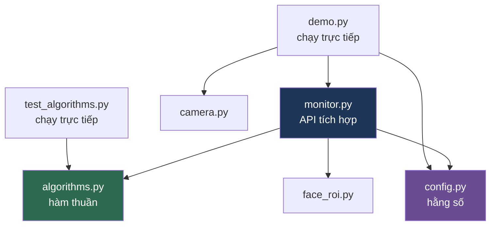
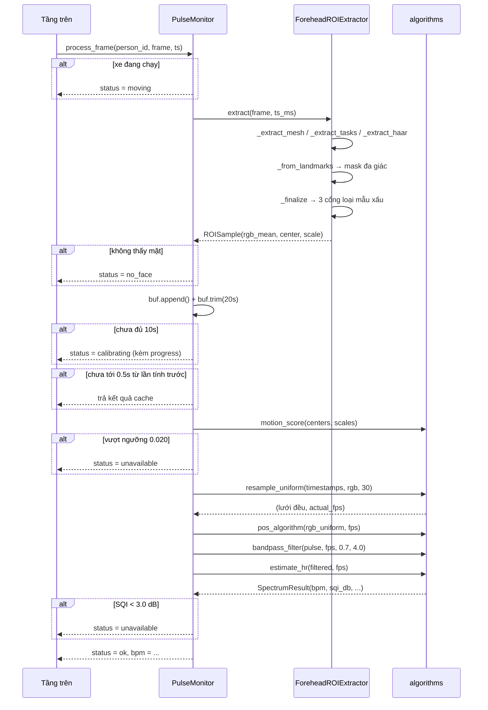

# Cấu trúc mã nguồn — Module rPPG (Heart_rate)

Tài liệu tra cứu: **file nào làm gì, chứa hàm nào, hàm nào gọi hàm nào.**

Bổ trợ cho [BAO_CAO_KY_THUAT.md](Heart_rate/BAO_CAO_KY_THUAT.md) (đánh giá chất lượng và phát hiện vấn đề). File này chỉ mô tả cấu trúc.

---

## 1. Bảng tổng quan

> **Cấu trúc thư mục** — 5 module thư viện nằm trong package `Heart_rate/rppg/`; `demo.py` và `test_algorithms.py` ở thư mục cha `Heart_rate/`. Chạy mọi lệnh từ `Heart_rate/`.

| File | Dòng | Vai trò một câu | Ai gọi nó |
|---|---:|---|---|
| [\_\_init\_\_.py](Heart_rate/rppg/__init__.py) | 42 | Bề mặt API công khai của package | người dùng ngoài |
| [config.py](Heart_rate/rppg/config.py) | 83 | Chứa **toàn bộ hằng số** của hệ thống, một chỗ duy nhất | monitor, demo |
| [algorithms.py](Heart_rate/rppg/algorithms.py) | 299 | **Toán xử lý tín hiệu** — hàm thuần, không trạng thái, không phụ thuộc phần cứng | monitor, test |
| [face_roi.py](Heart_rate/rppg/face_roi.py) | 285 | Khung hình → **giá trị trung bình RGB vùng trán** | monitor |
| [camera.py](Heart_rate/rppg/camera.py) | 95 | Mở camera và **khóa chế độ tự động** | demo |
| [monitor.py](Heart_rate/rppg/monitor.py) | 350 | **API tích hợp** — điều phối, buffer, cổng chất lượng, trạng thái | demo, người dùng ngoài |
| [demo.py](Heart_rate/demo.py) | 288 | Giao diện trực quan để quay video trình diễn | chạy trực tiếp |
| [test_algorithms.py](Heart_rate/test_algorithms.py) | 181 | Kiểm chứng thuật toán bằng tín hiệu có đáp án biết trước | chạy trực tiếp |
| [console.py](Heart_rate/rppg/console.py) | 60 | Cho phép console Windows in được tiếng Việt và mã màu | demo, test |
| [download_model.py](Heart_rate/rppg/download_model.py) | 68 | Tải model landmark của MediaPipe về `models/` | chạy trực tiếp |
| [requirements.txt](Heart_rate/requirements.txt) | 4 | numpy, scipy, opencv-python, mediapipe (tùy chọn) | — |

**Chia làm ba nhóm:**

- **Lõi thư viện** (4 file): `config` · `algorithms` · `face_roi` · `monitor` — đây là thứ được import khi tích hợp
- **Tiện ích** (3 file): `camera` (khi tự mở webcam) · `console` (khi in ra terminal) · `download_model` (lúc cài đặt)
- **Chạy trực tiếp** (2 file): `demo` · `test_algorithms` — không ai import chúng

---

## 2. Sơ đồ phụ thuộc



Điểm quan trọng của sơ đồ: **`algorithms.py` không có mũi tên đi ra** ngoài numpy/scipy. Nó không biết gì về camera, MediaPipe hay OpenCV. Đó là lý do `test_algorithms.py` kiểm chứng được thuật toán mà không cần phần cứng.

`camera.py` cũng tách rời — `monitor.py` không gọi nó. Bạn hoàn toàn có thể lấy khung hình từ nguồn khác (file video, luồng mạng, camera IP) rồi đưa thẳng vào `process_frame()`.

---

## 3. Chi tiết từng file

### 3.1 `config.py` — Hằng số hệ thống

**Vai trò:** mọi con số điều chỉnh được của hệ thống nằm ở đây. Khi hiệu chỉnh ngưỡng trên dữ liệu thật, chỉ sửa file này — không rải magic number khắp code.

| Thành phần | Kiểu | Vai trò |
|---|---|---|
| `RPPGConfig` | dataclass | 15 tham số cấu hình |
| `RPPGConfig.__post_init__()` | method | Kiểm tra tính hợp lệ lúc khởi tạo |
| `DEFAULT_CONFIG` | instance | Bản mặc định dùng chung |

**15 tham số, nhóm theo mục đích:**

| Nhóm | Tham số | Mặc định | Ý nghĩa |
|---|---|---:|---|
| Cửa sổ | `window_sec` | 20.0 | Độ dài cửa sổ phân tích |
| | `min_window_sec` | 10.0 | Tối thiểu phải tích lũy trước khi trả số |
| | `resample_fps` | 30.0 | Tần số lưới đều (**không** phải fps camera) |
| | `update_interval_sec` | 0.5 | Giãn cách giữa hai lần tính FFT |
| Dải tần | `hr_min_hz` | 0.7 | 42 BPM |
| | `hr_max_hz` | 4.0 | 240 BPM |
| | `bandpass_order` | 3 | Bậc Butterworth |
| Cổng SQI | `sqi_threshold_db` | 3.0 | Dưới ngưỡng → không trả số |
| | `sqi_peak_halfwidth_hz` | 0.2 | Bề rộng nửa dải quanh đỉnh |
| | `sqi_include_harmonic` | True | Tính cả hài bậc 1 vào năng lượng tín hiệu |
| Cổng chuyển động | `motion_threshold` | 0.020 | Vượt ngưỡng → không trả số |
| | `motion_gate_enabled` | True | Bật/tắt cổng |
| ROI | `roi_trim_percent` | 20.0 | Cắt 10 % sáng nhất + 10 % tối nhất |
| | `roi_min_pixels` | 200 | ROI nhỏ hơn thì loại mẫu |
| Bộ nhớ | `person_ttl_sec` | 60.0 | Giải phóng buffer sau ngần này giây vắng mặt |

`__post_init__()` kiểm tra 3 điều kiện: `min_window_sec ≤ window_sec`, `hr_min_hz < hr_max_hz`, `0 ≤ roi_trim_percent < 50`.

---

### 3.2 `algorithms.py` — Xử lý tín hiệu

**Vai trò:** toàn bộ phần toán. Mọi hàm ở đây là **hàm thuần** — cùng đầu vào luôn cho cùng đầu ra, không giữ trạng thái, không tác dụng phụ.

| Hàm / Lớp | Chữ ký rút gọn | Vai trò |
|---|---|---|
| `resample_uniform` | `(timestamps, values, target_fps) → (array, actual_fps)` | Nội suy chuỗi lấy mẫu **không đều** về lưới thời gian **đều** |
| `pos_algorithm` | `(rgb, fps) → array` | Trích tín hiệu mạch đập thô từ chuỗi RGB |
| `_pos_single_window` | `(block) → array` | *(riêng tư)* Áp POS cho đúng một cửa sổ |
| `bandpass_filter` | `(sig, fps, low_hz, high_hz, order) → array` | Butterworth thông dải, lọc hai chiều |
| `SpectrumResult` | dataclass | Kết quả phân tích phổ |
| `estimate_hr` | `(sig, fps, ...) → SpectrumResult` | Tìm nhịp tim + tính SQI từ phổ |
| `motion_score` | `(centers, scales) → float` | Đo mức rung của khuôn mặt |

**Hằng số riêng tư:** `_POS_PROJECTION` (ma trận chiếu 2×3 của Wang 2017), `_POS_WINDOW_SEC = 1.6` (độ dài cửa sổ trượt theo bài báo gốc).

**Trường của `SpectrumResult`:**

| Trường | Kiểu | Ghi chú |
|---|---|---|
| `bpm` | `float \| None` | `None` khi không tìm được đỉnh hợp lệ |
| `sqi_db` | `float` | Tỉ số tín hiệu/nhiễu, đơn vị dB |
| `freqs_hz` | `array` | Trục tần số — để vẽ phổ trong demo |
| `power` | `array` | Phổ công suất đã chuẩn hóa về [0, 1] |
| `peak_hz` | `float \| None` | Vị trí đỉnh |

**Bốn hàm công khai xếp thành chuỗi:**

```
resample_uniform  →  pos_algorithm  →  bandpass_filter  →  estimate_hr
   lưới đều           tín hiệu mạch      lọc 0.7–4 Hz       BPM + SQI
```

`motion_score` đứng riêng, chạy song song với chuỗi trên để quyết định có tin kết quả hay không.

---

### 3.3 `face_roi.py` — Trích xuất ROI

**Vai trò:** biến một khung hình BGR thành **ba con số** (trung bình R, G, B của vùng trán), kèm tâm và kích thước khuôn mặt để tính chuyển động.

| Hàm / Lớp | Chữ ký rút gọn | Vai trò |
|---|---|---|
| `ROISample` | dataclass | Một mẫu trích từ đúng một khung hình |
| `_trimmed_channel_means` | `(frame_bgr, mask, trim_percent) → array \| None` | *(riêng tư)* Trung bình từng kênh sau khi cắt hai đầu |
| `ForeheadROIExtractor` | class | Bộ trích xuất, tự chọn backend |

**Trường của `ROISample`:**

| Trường | Kiểu | Ghi chú |
|---|---|---|
| `ok` | `bool` | Mẫu này dùng được không |
| `rgb_mean` | `array(3) \| None` | Theo thứ tự **R, G, B** (đã đảo từ BGR) |
| `center` | `array(2) \| None` | Tâm khuôn mặt, đơn vị pixel |
| `scale` | `float` | Kích thước đặc trưng (khoảng cách hai đuôi mắt) |
| `mask` | `array \| None` | Mask ROI — để vẽ overlay |
| `reason` | `str` | Lý do thất bại, bằng tiếng Việt, để gỡ lỗi |

**Phương thức của `ForeheadROIExtractor`:**

| Phương thức | Vai trò |
|---|---|
| `__init__(trim_percent, min_pixels, task_model_path)` | Thử lần lượt 3 backend, dừng ở cái đầu tiên dùng được |
| `backend` *(thuộc tính)* | Tên backend đang dùng — nên log lúc khởi động |
| **`extract(frame_bgr, timestamp_ms)`** | **API chính** — điều hướng sang đúng backend |
| `_extract_mesh(frame_bgr)` | Backend 1 — `mediapipe.solutions.face_mesh` |
| `_extract_tasks(frame_bgr, timestamp_ms)` | Backend 2 — `mediapipe.tasks.FaceLandmarker` |
| `_extract_haar(frame_bgr)` | Backend 3 — OpenCV Haar cascade |
| `_from_landmarks(frame_bgr, points)` | Dùng chung cho backend 1 và 2: landmark → mask đa giác |
| `_finalize(frame_bgr, mask, center, scale)` | Dùng chung cho cả 3: mask → `ROISample`, áp 3 cổng loại mẫu xấu |
| `close()` / `__enter__` / `__exit__` | Vòng đời, dùng được với `with` |

**Ba backend xếp tầng** — thử theo thứ tự, cái nào chạy được thì dừng:

| # | Backend | `backend` trả về | Ưu / Nhược |
|---|---|---|---|
| 1 | `mediapipe.solutions.face_mesh` | `"mediapipe_solutions"` | Không cần tải model — **đã chết từ mediapipe 0.10.30** |
| 2 | `mediapipe.tasks.FaceLandmarker` | `"mediapipe_tasks"` | Landmark 468 điểm, cần file `.task` — **đường chính hiện nay** |
| 3 | OpenCV Haar cascade | `"haar_cascade"` | Luôn có sẵn, ROI là hình chữ nhật thô |

Lý do làm cả ba: các phiên bản MediaPipe expose API khác nhau. Trong nhóm nhiều người gần như chắc chắn sẽ lệch phiên bản, fallback giúp không ai bị chặn vì lỗi cài đặt.

> Cơ chế này **đã tự chứng minh giá trị**: mediapipe 0.10.35 bỏ hẳn `mp.solutions`, backend 1 chết, hệ thống tự rơi xuống backend 2 mà không cần sửa dòng nào. Backend 2 cần model rời — chạy `python -m rppg.download_model`, hoặc đặt biến môi trường `FACE_LANDMARKER_TASK` trỏ tới file `.task` có sẵn.

**Ba cổng loại mẫu xấu** (trong `_finalize`): ROI dưới 200 px · ROI quá tối (trung bình < 15) · ROI cháy sáng (đỉnh > 250).

**Hằng số:** `FOREHEAD_LANDMARKS` (14 điểm bao vùng trán trên lưới 468 điểm), `LEFT_EYE_OUTER = 33`, `RIGHT_EYE_OUTER = 263`.

---

### 3.4 `camera.py` — Tiện ích camera

**Vai trò:** mở camera và **khóa auto-exposure / auto-white-balance**. Nhỏ nhất module nhưng chặn đúng chế độ hỏng khó chẩn đoán nhất — vòng lặp tự động phơi sáng chủ động triệt tiêu chính dao động độ sáng mà rPPG cần đo.

| Hàm | Chữ ký rút gọn | Vai trò |
|---|---|---|
| `open_camera` | `(index, width, height, fps, lock_exposure, exposure_value) → VideoCapture` | Mở và cấu hình camera |
| `describe_settings` | `(cap) → str` | Chuỗi mô tả cấu hình thực tế — in ra lúc khởi động để kiểm tra |

`open_camera()` làm 3 việc: set độ phân giải/fps · đặt `BUFFERSIZE = 1` để timestamp sát thời điểm chụp thật · tắt `AUTO_EXPOSURE` và `AUTO_WB`.

Docstring đầu file liệt kê **bốn cái bẫy** làm hỏng demo rPPG: auto-exposure · đèn huỳnh quang 50 Hz (nhấp nháy 100 Hz, aliasing xuống thẳng dải 0,7–4 Hz) · nén video xóa mức điều biến 0,1–1 % · dùng thứ tự khung hình thay vì timestamp.

> ⚠️ Giá trị `0.25` cho `CAP_PROP_AUTO_EXPOSURE` là quy ước **V4L2 (Linux)**. Trên Windows backend khác → khóa có thể im lặng không tác dụng. Xem mục V10 trong báo cáo kỹ thuật.

---

### 3.5 `monitor.py` — API tích hợp

**Vai trò:** **file duy nhất cần đọc để tích hợp.** Mọi thứ khác là chi tiết bên trong. Nhiệm vụ: giữ buffer theo từng người, áp các cổng chất lượng, điều phối chuỗi thuật toán, và trả về trạng thái có ý nghĩa.

| Thành phần | Kiểu | Vai trò |
|---|---|---|
| `STATUS_*` (5 hằng) | `str` | Các giá trị hợp lệ của trường `status` |
| `PulseResult` | dataclass | **Kiểu trả về** cho mỗi khung hình |
| `_PersonBuffer` | class | *(riêng tư)* Buffer tín hiệu của một người |
| `PulseMonitor` | class | **Lớp chính** |

#### Năm trạng thái

| Hằng số | Giá trị | Nghĩa | Có `bpm` không |
|---|---|---|:---:|
| `STATUS_OK` | `"ok"` | Đo được, số dùng được | ✅ |
| `STATUS_CALIBRATING` | `"calibrating"` | Đang tích lũy dữ liệu | ❌ |
| `STATUS_UNAVAILABLE` | `"unavailable"` | Đủ dữ liệu nhưng chất lượng không đạt | ❌ |
| `STATUS_NO_FACE` | `"no_face"` | Không thấy khuôn mặt | ❌ |
| `STATUS_MOVING` | `"moving"` | Xe đang chạy | ❌ |

#### `PulseResult`

| Trường | Kiểu | Ghi chú |
|---|---|---|
| `person_id` | `str` | Định danh người |
| `status` | `str` | Một trong 5 hằng số trên |
| `timestamp` | `float` | Thời điểm |
| `bpm` | `float \| None` | **Chỉ khác `None` khi `status == "ok"`** |
| `sqi_db` | `float \| None` | Tỉ số tín hiệu/nhiễu |
| `buffer_sec` | `float` | Đã tích lũy bao nhiêu giây |
| `progress` | `float` | Tiến độ hiệu chuẩn, 0…1 — để vẽ thanh tiến trình |
| `motion` | `float \| None` | Điểm chuyển động, càng nhỏ càng tĩnh |
| `reason` | `str` | Giải thích khi không có số |
| `spectrum` | `SpectrumResult \| None` | **Chỉ để demo/gỡ lỗi, không gửi qua mạng** |

| Phương thức | Vai trò |
|---|---|
| `to_dict()` | Bản gọn để serialize JSON — **đã loại bỏ `spectrum`** |

#### `_PersonBuffer` *(riêng tư)*

Dùng `__slots__` để tiết kiệm bộ nhớ. Giữ 4 danh sách song song: `timestamps`, `rgb`, `centers`, `scales`.

| Phương thức | Vai trò |
|---|---|
| `append(ts, rgb, center, scale)` | Thêm một mẫu, cập nhật `last_seen` |
| `trim(window_sec)` | Bỏ các mẫu cũ hơn cửa sổ phân tích |
| `duration` *(thuộc tính)* | Số giây đang giữ trong buffer |

#### `PulseMonitor`

| Phương thức | Vai trò |
|---|---|
| `__init__(config, extractor)` | Cả hai tham số tùy chọn — tự tạo nếu không truyền |
| `backend` *(thuộc tính)* | Backend phát hiện khuôn mặt đang dùng |
| **`process_frame(person_id, frame_bgr, timestamp, vehicle_stationary)`** | **API chính** — nạp một khung hình, trả `PulseResult` |
| `_compute(person_id, buf, ts)` | *(riêng tư)* Chạy chuỗi thuật toán và áp hai cổng |
| `_evict_stale(now)` | *(riêng tư)* Giải phóng buffer của người đã rời khung hình |
| `reset(person_id)` | Xóa buffer một người, hoặc tất cả nếu `None` |
| `tracked_persons` *(thuộc tính)* | Danh sách `person_id` đang giữ buffer |
| `close()` / `__enter__` / `__exit__` | Vòng đời, dùng được với `with` |

#### Hợp đồng giao diện — bốn điều ràng buộc nhóm tích hợp

1. Đầu ra là **tín hiệu hiển thị và bối cảnh**, không phải nguồn kích hoạt cảnh báo
2. Khi `status != "ok"` thì **không có số** — hiển thị `--`, tuyệt đối không dùng lại giá trị cũ
3. rPPG chỉ hợp lệ khi xe **đứng yên** — tầng trên nên chỉ gọi khi tốc độ < 2 km/h
4. `bpm` **không** dùng để suy ra đột quỵ, căng thẳng hay buồn ngủ

---

### 3.6 `demo.py` — Giao diện trình diễn

**Vai trò:** chạy trực tiếp để quay video. Ghép khung hình camera với panel thông tin bên phải (rộng 400 px) hiển thị trạng thái, số BPM, các chỉ số kỹ thuật và **đồ thị phổ tần số**.

| Hàm | Vai trò |
|---|---|
| `main()` | Đọc tham số dòng lệnh, vòng lặp chính, xử lý phím |
| `draw_panel(result, cfg, height, motion_gate_on)` | Dựng toàn bộ panel bên phải |
| `draw_spectrum(panel, spectrum, cfg, y0, height)` | Vẽ đồ thị phổ — **tài sản demo quan trọng nhất** |
| `_wrap(text, width)` | *(riêng tư)* Ngắt dòng chuỗi `reason` cho vừa panel |

**Tham số dòng lệnh:**

| Tham số | Mặc định | Vai trò |
|---|---|---|
| `--camera N` | 0 | Chọn webcam |
| `--video FILE` | — | Chạy lại trên file đã quay thay vì webcam |
| `--record FILE` | — | Ghi màn hình demo ra mp4 |
| `--window GIÂY` | 20.0 | Cửa sổ phân tích |
| `--sqi dB` | 3.0 | Ngưỡng SQI |
| `--no-lock` | tắt | **Không** khóa exposure — chỉ để minh họa hậu quả |

**Phím tắt:** `q`/`ESC` thoát · `r` xóa buffer đo lại · `m` bật/tắt cổng chuyển động · `s` chụp ảnh màn hình.

Đồ thị phổ đổi màu theo SQI: **xanh** khi đạt ngưỡng, **đỏ** khi không. Đây là chỗ biến lập luận trung thực từ chỗ *nói ra* thành chỗ *nhìn thấy được* — lúc ngồi yên là một đỉnh sạch, lúc lắc là một mớ lộn xộn.

---

### 3.7 `test_algorithms.py` — Kiểm chứng

**Vai trò:** tạo tín hiệu **biết trước đáp án**, chạy qua pipeline, kiểm tra có khôi phục đúng không. Khi chạy trên camera thật, không có cách nào biết BPM trả về là đúng hay là ảo — file này giải quyết đúng chỗ đó.

| Hàm | Vai trò |
|---|---|
| `synth_rgb(bpm, duration, fps, amplitude, noise, illum_drift, seed)` | Tạo chuỗi RGB giả lập vùng da có mạch đập |
| `run_pipeline(rgb, fps)` | Chạy `pos → bandpass → estimate_hr` |
| `check(name, condition, detail)` | In kết quả một kiểm tra, ghi nhận nếu hỏng |

`synth_rgb()` mô phỏng đúng thang thực tế: biên độ mạch **0,6 % mức DC** · kênh xanh lá nhạy nhất với hemoglobin, đỏ ít nhạy nhất · có hài bậc 1 như dạng sóng mạch thật · có trôi chiếu sáng dạng nhân mà POS phải triệt được.

**Năm nhóm kiểm tra, 14 khẳng định:**

| # | Nhóm | Số check | Kiểm cái gì |
|---:|---|---:|---|
| 1 | Khôi phục nhịp tim | 6 | Sai số < 3 BPM trên dải 48–140 |
| 2 | Cổng SQI | 4 | Tách biệt tín hiệu sạch với nhiễu trắng |
| 3 | Resample | 2 | Hậu quả của việc tin fps camera khai báo |
| 4 | Độ dài cửa sổ | 1 | Cửa sổ dài không tệ hơn cửa sổ ngắn |
| 5 | Chỉ số chuyển động | 2 | Phân biệt ngồi yên với rung lắc |

Thoát với mã 1 nếu có kiểm tra hỏng — dùng được trong CI.

---

## 4. Đường đi của một khung hình

Trình tự gọi hàm đầy đủ khi tầng trên gọi `process_frame()` một lần:



**Sáu chỗ có thể thoát sớm** — mỗi chỗ trả về một `status` khác nhau kèm `reason` giải thích. Không có nhánh nào trả về một con số đoán.

---

## 5. Bảng tra nhanh — "muốn sửa X thì vào đâu"

| Muốn làm gì | Vào file | Vào hàm / tham số |
|---|---|---|
| Đổi ngưỡng SQI, ngưỡng chuyển động, độ dài cửa sổ | `config.py` | Trường tương ứng của `RPPGConfig` |
| Đổi vùng ROI (má thay vì trán) | `face_roi.py` | `FOREHEAD_LANDMARKS`, `_extract_haar` |
| Thêm thuật toán rPPG khác (CHROM, ICA) | `algorithms.py` | Viết hàm mới cạnh `pos_algorithm` |
| Đổi cách tính SQI | `algorithms.py` | `estimate_hr`, phần `--- Tính SQI ---` |
| Thêm một trạng thái mới | `monitor.py` | Hằng `STATUS_*` + `_compute` + `STATUS_TEXT` trong `demo.py` |
| Đổi thứ gì trả về cho tầng trên | `monitor.py` | `PulseResult` và `to_dict()` |
| Sửa giao diện demo | `demo.py` | `draw_panel`, `draw_spectrum` |
| Thêm ca kiểm thử | `test_algorithms.py` | `check(...)` ở cuối nhóm phù hợp |
| Sửa cấu hình camera | `camera.py` | `open_camera` |

---

## 6. Bề mặt API công khai

Đây là toàn bộ những gì tầng trên cần biết — mọi thứ còn lại là chi tiết bên trong:

```python
from rppg import PulseMonitor, RPPGConfig

monitor = PulseMonitor(config=RPPGConfig(window_sec=20.0))
result  = monitor.process_frame("driver", frame_bgr, timestamp=time.time())

if result.status == "ok":
    hien_thi(result.bpm)          # float, ví dụ 72.4
else:
    hien_thi("--")                # KHÔNG hiển thị số cũ, KHÔNG đoán
```

| Tên | Từ đâu | Vai trò |
|---|---|---|
| `PulseMonitor` | `monitor.py` | Lớp chính |
| `PulseResult` | `monitor.py` | Kiểu trả về |
| `RPPGConfig` | `config.py` | Cấu hình |
| `STATUS_*` | `monitor.py` | 5 hằng số trạng thái |
| `ForeheadROIExtractor` | `face_roi.py` | Chỉ cần nếu muốn tự cấp extractor |
| `open_camera`, `describe_settings` | `camera.py` | Chỉ cần nếu tự mở webcam |

> ⚠️ Hiện các lệnh import trên **chưa chạy được** — thư mục tên `Heart_rate/` chứ không phải `rppg/`, và thiếu `__init__.py`. Xem mục V1 và bảng khuyến nghị trong [BAO_CAO_KY_THUAT.md](Heart_rate/BAO_CAO_KY_THUAT.md).
