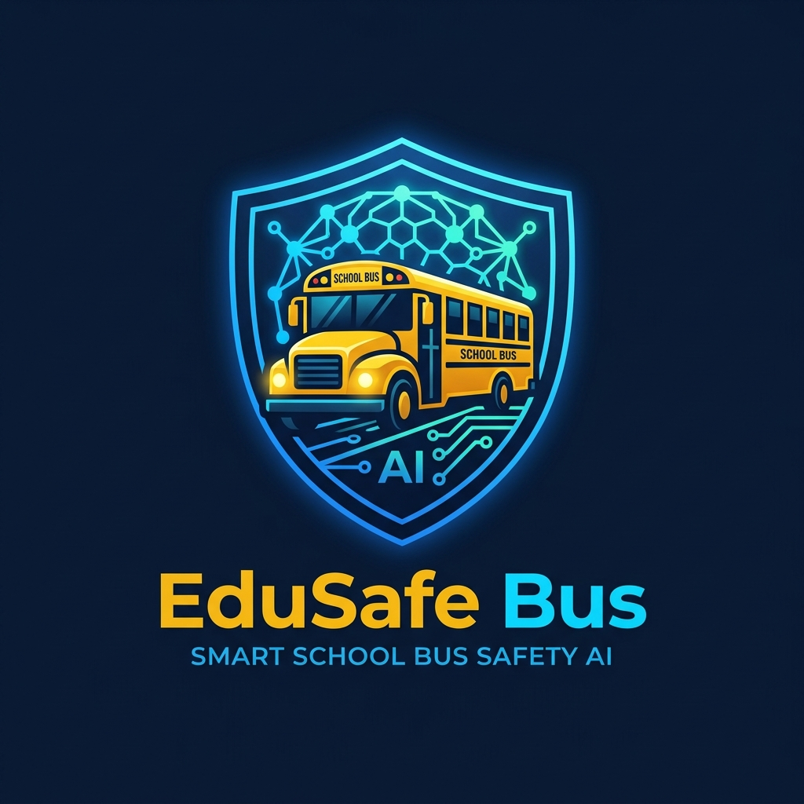

<div align="center">



# EduSafe Bus - Nền Tảng Giám Sát An Toàn Xe Đưa Đón Học Sinh Ứng Dụng AI Thông Minh

[](https://react.dev/)
[](https://vitejs.dev/)
[](https://www.python.org/)
[](https://pytorch.org/)
[](https://www.tensorflow.org/)
[](https://fastapi.tiangolo.com/)
[](https://www.docker.com/)
[](https://www.postgresql.org/)
[](https://redis.io/)
[](https://www.rabbitmq.com/)
[](LICENSE)

*Dự án Khởi nghiệp Đổi mới Sáng tạo & Công nghệ An toàn Giao thông Học đường 2026*

</div>

---

## 📑 Mục Lục (Table of Contents)

1. [Giới Thiệu & Bài Toán Giải Quyết](#-1-giới-thiệu--bài-toán-giải-quyết)
2. [Bộ Công Nghệ Cốt Lõi (Tech Stack)](#-2-bộ-công-nghệ-cốt-lõi-tech-stack)
3. [Cấu Trúc Thư Mục Dự Án (Project Structure)](#-3-cấu-trúc-thư-mục-dự-án-project-structure)
4. [Pipeline Hoạt Động Cốt Lõi Của Hệ Thống](#-4-pipeline-hoạt-động-cốt-lõi-của-hệ-thống)
   - [4.1. Pipeline Điểm Danh Sinh Trắc Học AI Edge (Face Recognition)](#41-pipeline-điểm-danh-sinh-trắc-học-ai-edge-face-recognition)
   - [4.2. Pipeline Giám Sát Tài Xế & Cảnh Báo Ngủ Gật (Drowsiness Engine)](#42-pipeline-giám-sát-tài-xế--cảnh-báo-ngủ-gật-drowsiness-engine)
   - [4.3. Pipeline Định Vị GPS & Thuật Toán Lệch Tuyến Haversine](#43-pipeline-định-vị-gps--thuật-toán-lệch-tuyến-haversine)
   - [4.4. Pipeline Điều Phối Báo Động Khẩn Cấp & Ma Trận SOS](#44-pipeline-điều-phối-báo-động-khẩn-cấp--ma-trận-sos)
5. [Danh Sách Tài Khoản Phân Quyền (Demo Credentials)](#-5-danh-sách-tài-khoản-phân-quyền-demo-credentials)
6. [Cấu Hình Môi Trường & Hướng Dẫn Cài Đặt (Setup & Run)](#-6-cấu-hình-môi-trường--hướng-dẫn-cài-đặt-setup--run)
   - [6.1. Chạy Môi Trường Local Development](#61-chạy-môi-trường-local-development)
   - [6.2. Đóng Gói & Chạy Bằng Docker Compose](#62-đóng-gói--chạy-bằng-docker-compose)
   - [6.3. Cấu Hình Biến Môi Trường (.env)](#63-cấu-hình-biến-môi-trường-env)
7. [Quy Trình Triển Khai Sản Phẩm (Production Deployment)](#-7-quy-trình-triển-khai-sản-phẩm-production-deployment)
8. [Tác Giả & Bản Quyền (License)](#-8-tác-giả--bản-quyền-license)

---

## 🎯 1. Giới Thiệu & Bài Toán Giải Quyết

**EduSafe Bus** là nền tảng công nghệ toàn diện ứng dụng **Trí tuệ nhân tạo (AI Edge)** và **Internet vạn vật (IoT)** nhằm xây dựng *"Lá chắn an toàn 4 lớp"* giải quyết triệt để 3 nỗi đau nhức nhối trong hoạt động đưa đón học sinh:

1. **Rủi ro bỏ quên học sinh trên xe:** Tự động đối soát danh sách đón/trả bằng nhận diện khuôn mặt kết hợp quy trình bắt buộc rà soát khoang xe cuối hành trình (*End-trip Cabin Sweep*).
2. **Tai nạn do tài xế mất tập trung hoặc ngủ gật:** Lõi AI giám sát mắt (`EAR`), ngáp (`MAR`), gật đầu (`Pitch`) và tổng hợp điểm rủi ro theo mô hình *Noisy-OR Bayesian Fusion*, phát còi hú cảnh báo ngay tại cabin.
3. **Xe chệch lộ trình, trễ tuyến:** Thuật toán chiếu vector khoảng cách *Haversine GPS* cảnh báo lập tức khi xe lệch tuyến > 100m, cho phép phụ huynh và nhà trường phát lệnh khẩn cấp tức thời.

---

## 💻 2. Bộ Công Nghệ Cốt Lõi (Tech Stack)

| Lớp Công Nghệ | Thành Phần Sử Dụng | Vai Trò Kỹ Thuật |
| :--- | :--- | :--- |
| **Frontend UI/UX** | React 19, Vite 8, Vanilla CSS3 Glassmorphism, Lucide Icons | Giao diện tương phản cao Dark Mode, thời gian phản hồi siêu tốc, tương thích đa thiết bị |
| **Edge AI & Computer Vision** | `face-api.js`, Python 3.12, PyTorch / TensorFlow, OpenCV | Trích xuất Vector 128-D nhận diện khuôn mặt và tính toán chỉ số sinh trắc học ngay tại Client |
| **Backend & Microservices** | Node.js / Express, Python FastAPI, WebSockets (Socket.io) | Xử lý nghiệp vụ, API RESTful hiệu năng cao và kênh truyền nhận dữ liệu thời gian thực |
| **Message Broker & Queue** | RabbitMQ, Redis Pub/Sub | Điều phối hàng đợi sự kiện SOS, phân phối tin nhắn khẩn cấp có độ trễ < 200ms |
| **Database & Caching** | PostgreSQL 16, Redis Cache | Lưu trữ dữ liệu quan hệ có cấu trúc và cache tọa độ GPS, session người dùng |
| **DevOps & Container** | Docker Multi-stage, Docker Compose, Nginx, GitHub Actions CI | Đóng gói ứng dụng tiêu chuẩn, tối ưu dung lượng ảnh và tự động hóa kiểm thử build |

---

## 📂 3. Cấu Trúc Thư Mục Dự Án (Project Structure)

```text
RedVelvet/
├── .github/
│   └── workflows/
│       └── ci.yml                      # GitHub Actions tự động kiểm thử Build CI
├── public/                             # Tài nguyên tĩnh phục vụ Nginx & Web
│   ├── models/                         # Trọng số mô hình AI face-api.js (SSD Mobilenet, Landmark)
│   ├── edusafe_logo.png                # Logo nhận diện thương hiệu EduSafe Bus
│   ├── erd.png                         # Sơ đồ quan hệ thực thể cơ sở dữ liệu (ERD)
│   ├── system_architecture.png         # Sơ đồ kiến trúc vi dịch vụ hệ thống
│   ├── user_flow.png                   # Sơ đồ luồng tương tác người dùng
│   └── face-api.min.js                 # Thư viện AI trích xuất vector khuôn mặt
├── src/
│   ├── assets/                         # Ảnh biểu tượng và hình động đồ họa
│   ├── components/                     # Các module giao diện theo phân quyền (Role Views)
│   │   ├── AdminDashboard.jsx          # Dashboard điều hành BGH, KPI an toàn & Live GPS Stream
│   │   ├── DriverTabletView.jsx        # Cabin tài xế: AI điểm danh, Lõi chống ngủ gật & Rà soát cuối xe
│   │   ├── TeacherMonitorView.jsx      # Giám sát tại trường, điểm danh từ xa & xác nhận thủ công (Fallback)
│   │   ├── ParentAppView.jsx           # App Phụ huynh: Live GPS tracking, cảnh báo lệch tuyến & SOS
│   │   ├── GlobalEmergencyBanner.jsx   # Thanh cảnh báo khẩn cấp đồng bộ thời gian thực toàn hệ thống
│   │   ├── SosModal.jsx                # Ma trận nút bấm SOS khẩn cấp đa kênh (113, 114, 115, BGH, Phụ huynh)
│   │   ├── LiveMapSimulator.jsx        # Bản đồ mô phỏng tọa độ vệ tinh & thuật toán lệch tuyến Haversine
│   │   ├── CameraAiOverlay.jsx         # Khung quét camera nhận diện khuôn mặt học sinh
│   │   ├── AIDevPanel.jsx              # Bảng kỹ thuật hiển thị cấu trúc JSON & AI specs cho BGK
│   │   ├── LoginScreen.jsx             # Màn hình đăng nhập tự động nhận diện phân quyền qua Email
│   │   └── Navbar.jsx                  # Thanh tiêu đề, thông tin phiên đăng nhập, đồng hồ & còi SOS
│   ├── utils/                          # Lõi thuật toán và động cơ xử lý logic
│   │   ├── alertEngine.js              # Lõi điều phối cảnh báo khẩn cấp (BroadcastChannel & Web Audio)
│   │   ├── drowsinessEngine.js         # Lõi phát hiện ngủ gật (EAR, MAR, Pitch & Noisy-OR Bayesian Fusion)
│   │   ├── faceEngine.js               # Lõi trích xuất 128-D descriptor, so khớp khoảng cách Euclid
│   │   └── mapTracking.js              # Lõi tính toán khoảng cách Haversine & bộ lọc làm mượt SMA GPS
│   ├── App.jsx                         # Component gốc quản lý Role Session & Đồng bộ Simulation
│   ├── App.css                         # Định dạng bố cục tổng thể
│   ├── index.css                       # Design System chuẩn: Mã màu, Typography Be Vietnam Pro & Reset CSS
│   └── main.jsx                        # Điểm khởi chạy ứng dụng React DOM
├── Dockerfile                          # Multi-stage Dockerfile tối ưu hóa kích thước image
├── docker-compose.yml                  # Cấu hình khởi chạy nhanh container dịch vụ
├── nginx.conf                          # Cấu hình máy chủ web Nginx phục vụ SPA và gzip caching
├── netlify.toml                        # Cấu hình tự động triển khai liên tục (CI/CD) trên Netlify
├── package.json                        # Khai báo gói thư viện và script quản lý dự án
└── vite.config.js                      # Cấu hình plugin React cho trình biên dịch Vite
```

---

## ⚡ 4. Pipeline Hoạt Động Cốt Lõi Của Hệ Thống

### 4.1. Pipeline Điểm Danh Sinh Trắc Học AI Edge (Face Recognition)
1. Luồng video từ camera xe bus được xử lý trực tiếp trên trình duyệt Client bằng WebAssembly/WebGL.
2. Trích xuất đặc trưng khuôn mặt thành mảng vector 128 chiều (`128-D descriptor`).
3. Đối khớp vector với cơ sở dữ liệu học sinh đã đăng ký qua khoảng cách Euclid (Euclidean Distance với threshold chuẩn `0.55`).
4. Tự động chuyển trạng thái học sinh thành `on_bus` (lên xe) hoặc `alighted` (xuống trạm).
5. **Cơ chế xác nhận thủ công (Manual Fallback):** Cho phép giáo viên xác nhận thủ công nếu học sinh đeo khẩu trang hoặc điều kiện ánh sáng yếu.

### 4.2. Pipeline Giám Sát Tài Xế & Cảnh Báo Ngủ Gật (Drowsiness Engine)
* **EAR (Eye Aspect Ratio):** Tính toán độ mở mắt; áp dụng vùng đệm Hysteresis (`0.19 - 0.23`) chống rung tín hiệu.
* **MAR (Mouth Aspect Ratio):** Nhận diện hành vi ngáp mệt mỏi khi MAR `> 0.55` kéo dài quá `1.5s`.
* **Head Pitch:** Theo dõi góc nghiêng đầu để phát hiện trạng thái gục ngã/mất tỉnh táo.
* **Noisy-OR Bayesian Fusion:** Kết hợp các yếu tố nguy cơ để tính toán điểm rủi ro tổng hợp (*Risk Score*). Khi tài xế nhắm mắt quá `2.5s`, còi hú báo động âm thanh lập tức kích hoạt trong cabin.

### 4.3. Pipeline Định Vị GPS & Thuật Toán Lệch Tuyến Haversine
* Thu thập tọa độ GPS với chu kỳ `1000ms`, áp dụng bộ lọc *Simple Moving Average (SMA)* để triệt tiêu sai số GPS.
* Chiếu vector vuông góc từ vị trí hiện tại của xe đến đoạn thẳng nối các Waypoints chuẩn.
* Nếu khoảng cách sai lệch thực tế lớn hơn `100m` (hoặc `150m`), hệ thống tự động kích hoạt cảnh báo chệch tuyến gửi tới phụ huynh và nhà trường.

### 4.4. Pipeline Điều Phối Báo Động Khẩn Cấp & Ma Trận SOS
* Hỗ trợ 4 kịch bản khẩn cấp: *Tai nạn giao thông, Hỏa hoạn/Cháy xe, Cấp cứu y tế/Sốc nhiệt, Kẻ xâm nhập/Uy hiếp*.
* Khi kích hoạt, tín hiệu được đẩy vào hàng đợi ưu tiên cao qua **RabbitMQ** và **WebSocket Broadcast**, hiển thị thanh **Global Emergency Banner** nhấp nháy đỏ trên toàn bộ các tài khoản đang đăng nhập với độ trễ `< 200ms`.

---

## 🔑 5. Danh Sách Tài Khoản Phân Quyền (Demo Credentials)

Hệ thống hỗ trợ cơ chế tự động nhận diện phân quyền thông minh dựa trên địa chỉ Email:

| Phân Quyền (Role) | Email Đăng Nhập | Mật Khẩu | Mục Đích Trải Nghiệm |
| :--- | :--- | :--- | :--- |
| **Quản Trị Viên Nhà Trường** | `admin@edusafe.edu.vn` | `admin123` | Giám sát KPI an toàn đội xe, live map GPS, nhật ký AI system và kích hoạt SOS |
| **Lái Xe Bus (Tablet Cabin)** | `driver.hung@edusafe.edu.vn` | `driver123` | Điểm danh camera AI, theo dõi chỉ số ngủ gật EAR/MAR, còi báo động và rà soát cuối xe |
| **Giáo Viên Giám Sát** | `teacher.thu@edusafe.edu.vn` | `teacher123` | Theo dõi danh sách điểm danh từ xa, xác nhận thủ công (Manual Fallback) khi quét lỗi |
| **Phụ Huynh Học Sinh** | `parent.chi@edusafe.edu.vn` | `parent123` | Theo dõi GPS xe thời gian thực, nhận cảnh báo xe lệch tuyến > 280m, gửi cảnh báo khẩn cấp |

---

## ⚙️ 6. Cấu Hình Môi Trường & Hướng Dẫn Cài Đặt (Setup & Run)

### 6.1. Chạy Môi Trường Local Development

**Yêu cầu hệ thống:**
* **Node.js:** Phiên bản `18.x` trở lên (Khuyến nghị `Node.js 20 LTS` hoặc `Node.js 22 LTS`)
* **NPM:** `v9.x` hoặc `v10.x`

**Các bước thực hiện:**
```bash
# 1. Clone mã nguồn dự án
git clone https://github.com/Mindoongie/RedVelvet.git
cd RedVelvet

# 2. Cài đặt các gói thư viện phụ thuộc
npm install

# 3. Khởi chạy máy chủ phát triển (Vite Dev Server)
npm run dev
```
Truy cập ứng dụng tại: `http://localhost:5173/`

### 6.2. Đóng Gói & Chạy Bằng Docker Compose

Dự án hỗ trợ đóng gói Production bằng Docker Multi-stage và Nginx:

```bash
# Xây dựng image và khởi chạy container chạy ngầm
docker-compose up -d --build

# Kiểm tra trạng thái hoạt động của container
docker-compose ps

# Xem nhật ký hoạt động (logs)
docker-compose logs -f

# Dừng container khi không sử dụng
docker-compose down
```
Truy cập ứng dụng qua Nginx tại cổng: `http://localhost:8080` (hoặc `http://localhost:5173`)

### 6.3. Cấu Hình Biến Môi Trường (.env)

Tạo file `.env` tại thư mục gốc của dự án dựa trên mẫu dưới đây:

```env
# ─── Cấu hình Ứng Dụng Client ─────────────────────────────────
VITE_APP_TITLE=EduSafe Bus Platform
VITE_APP_ENV=production
VITE_API_BASE_URL=https://api.edusafe.edu.vn/v1
VITE_WS_SERVER_URL=wss://ws.edusafe.edu.vn

# ─── Cấu hình Ngưỡng Thuật Toán AI Sinh Trắc Học ───────────────
VITE_FACE_MATCH_THRESHOLD=0.55
VITE_DROWSINESS_EAR_THRESHOLD=0.19
VITE_DROWSINESS_EAR_RECOVERY=0.23
VITE_DROWSINESS_MAR_THRESHOLD=0.55
VITE_GPS_DEVIATION_METERS=100

# ─── Cấu hình Tọa Độ Bản Đồ Mặc Định (TP. Hồ Chí Minh) ─────────
VITE_MAP_DEFAULT_LAT=10.7769
VITE_MAP_DEFAULT_LNG=106.7009
VITE_MAP_ZOOM_LEVEL=14
```

---

## 🌐 7. Quy Trình Triển Khai Sản Phẩm (Production Deployment)

### Triển khai tự động trên Netlify / Vercel (CI/CD)
1. Khi có commit mới được `git push` lên nhánh `main`, hệ thống Netlify/Vercel sẽ tự động kích hoạt tiến trình build:
   ```bash
   npm run build
   ```
2. Thư mục xuất bản `dist/` được tự động phân phối qua mạng lưới CDN toàn cầu với chứng chỉ bảo mật HTTPS miễn phí.
3. Để xem phiên bản cập nhật mới nhất, người dùng chỉ cần nhấn **`Ctrl + F5`** trên trình duyệt để làm mới bộ nhớ cache.

---

## 👥 8. Tác Giả & Bản Quyền (License)

* **Đơn vị phát triển:** Đội ngũ Khởi nghiệp EduSafe Bus – Cuộc thi Khởi nghiệp Sinh viên 2026
* **Giấy phép bản quyền:** Phát hành theo giấy phép [MIT License](LICENSE). &copy; 2026 EduSafe Bus Platform. All rights reserved.
