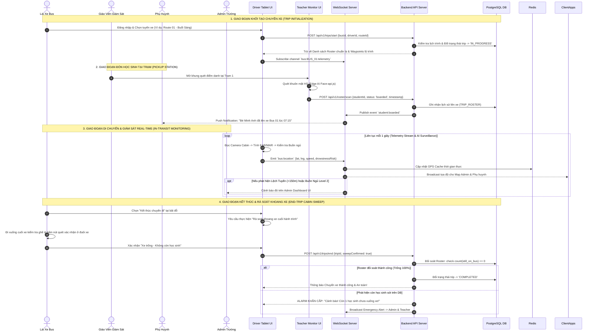
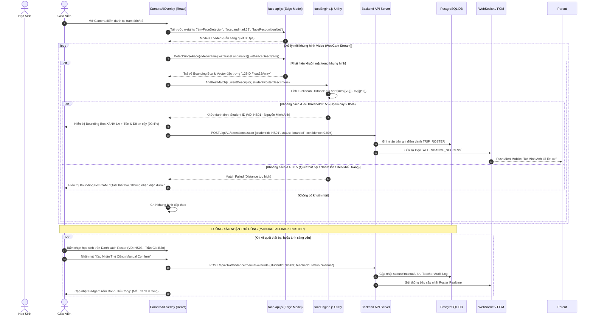
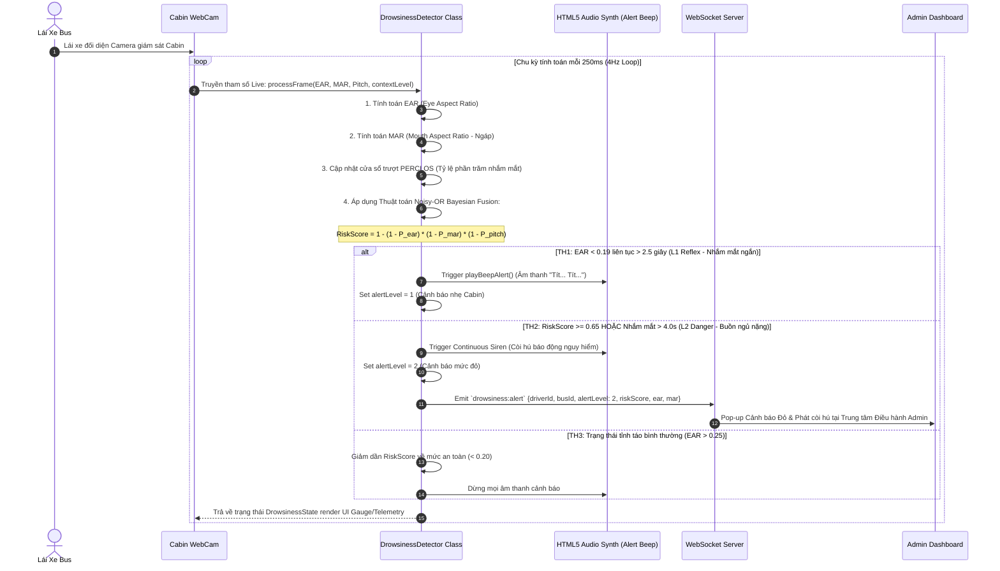
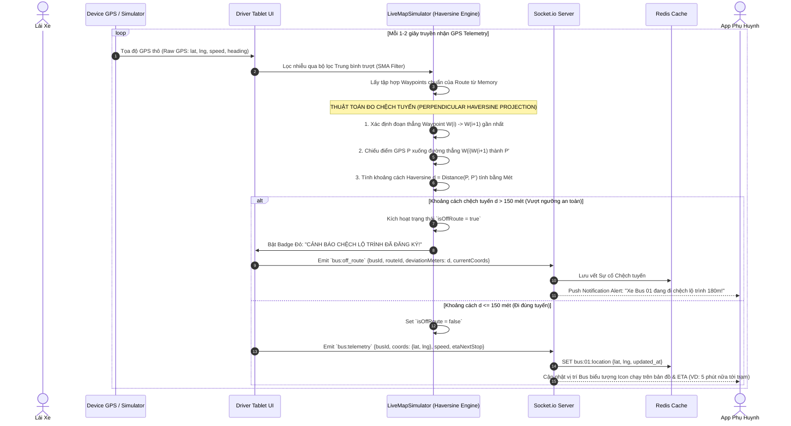
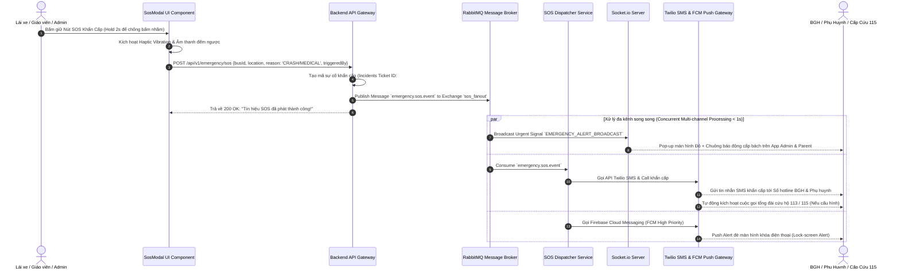
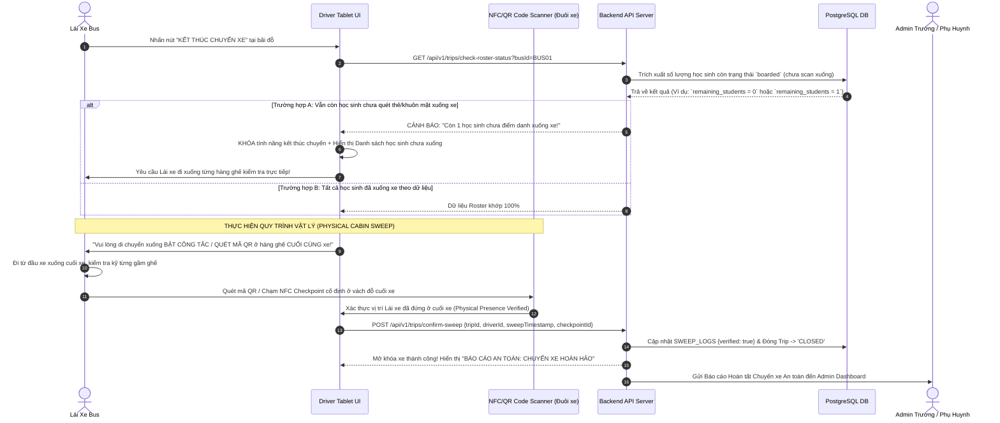

# SƠ ĐỒ TUẦN TỰ CHI TIẾT HỆ THỐNG EDUSAFE BUS (DETAILED SEQUENCE DIAGRAMS)

> **EduSafe Bus** — Nền tảng Giám sát An toàn Xe Đưa Đón Học sinh Thông minh tích hợp Trí tuệ Nhân tạo (AI Edge Computing), Định vị thời gian thực và Cảnh báo Đa kênh.

---

## 📑 MỤC LỤC
1. [Tổng Quan Thành Phần Hệ Thống (Participants & Components)](#1-tổng-quan-thành-phần-hệ-thống)
2. [Sơ Đồ 1: Tổng Thể Luồng Vận Hành Chuyến Xe (End-to-End Trip Lifecycle)](#2-sơ-đồ-1-tổng-thể-luồng-vận-hành-chuyến-xe)
3. [Sơ Đồ 2: Điểm Danh AI Edge Khuôn Mặt Học Sinh & Xác Nhận Thủ Công](#3-sơ-đồ-2-điểm-danh-ai-edge-khuôn-mặt-học-sinh--xác-nhận-thủ-công)
4. [Sơ Đồ 3: Giám Sát Buồn Ngủ & Mất Tập Trung Lái Xe (Noisy-OR Bayesian Engine)](#4-sơ-đồ-3-giám-sát-buồn-ngủ--mất-tập-trung-lái-xe)
5. [Sơ Đồ 4: Định Vị GPS Realtime & Thuật Toán Cảnh Báo Chệch Tuyến Haversine](#5-sơ-đồ-4-định-vị-gps-realtime--thuật-toán-cảnh-báo-chệch-tuyến-haversine)
6. [Sơ Đồ 5: Ma Trận Xử Lý Nút Bấm Khẩn Cấp (Emergency SOS Dispatcher)](#6-sơ-đồ-5-ma-trận-xử-lý-nút-bấm-khẩn-cấp)
7. [Sơ Đồ 6: Quy Trình Rà Soát Khoang Xe Cuối Hành Trình Chống Bỏ Quên (End-Trip Cabin Sweep)](#7-sơ-đồ-6-quy-trình-rà-soát-khoang-xe-cuối-hành-trình-chống-bỏ-quên)

---

## 1. TỔNG QUAN THÀNH PHẦN HỆ THỐNG

Các đối tượng tham gia trong các Sequence Diagram được định danh như sau:

| Loại | Tên Thành Phần | Ký Hiệu | Vai Trò & Chức Năng Kỹ Thuật |
| :--- | :--- | :--- | :--- |
| **Actors** | Lái Xe Bus | `Driver` | Thao tác Tablet Cabin, nhận cảnh báo ngủ gật, thực hiện End-Trip Sweep. |
| | Giáo Viên Giám Sát | `Teacher` | Dùng app camera quét khuôn mặt học sinh tại trạm đón/trả, xác nhận thủ công. |
| | Phụ Huynh Học Sinh | `Parent` | Nhận thông báo Push/SMS khi con lên/xuống xe, theo dõi vị trí xe real-time. |
| | Admin Nhà Trường | `Admin` | Giám sát điều hành toàn bộ đội xe, nhận cảnh báo chệch tuyến và SOS. |
| **Client / Edge** | App Lái Xe (Driver Tablet) | `Tablet` | Giao diện React SPA Cabin tích hợp WebCam & Drowsiness Engine. |
| | App Giáo Viên (Teacher App) | `TeacherApp` | Giao diện React SPA tích hợp WebCam AI & Face Recognition. |
| | App Phụ Huynh & Admin | `ClientApps` | Giao diện Web/Mobile React hiển thị Mapbox & Báo cáo Realtime. |
| **AI Engines** | Lõi Nhận Diện Khuôn Mặt | `FaceAI` | Thư viện `face-api.js` (tinyFaceDetector, 68 Landmarks, 128-D Descriptor). |
| | Lõi Giám Sát Buồn Ngủ | `DrowsyAI` | Thuật toán tính `EAR`, `MAR`, `Pitch` & Mạng Bayes `Noisy-OR Fusion`. |
| **Backend Services** | Backend API Gateway | `API` | Node.js / Express xử lý REST API, Authentication (JWT), Business Logic. |
| | Realtime WebSocket Server | `WS` | Socket.io Server broadcast vị trí GPS & Tín hiệu cảnh báo thời gian thực. |
| | Hàng Đợi Sự Kiện | `RabbitMQ` | Message Broker tiếp nhận và phân phối sự kiện khẩn cấp (SOS/Alerts). |
| **Storage** | Cache Bộ Nhớ Đệm | `Redis` | Lưu trữ vị trí GPS tức thời, Session và Socket ID mapping. |
| | Cơ Sở Dữ Liệu Quan Hệ | `PostgreSQL` | Lưu trữ Học sinh, Chuyến xe, Roster, Vector khuôn mặt, Nhật ký vi phạm. |
| **3rd Party APIs** | Dịch Vụ SMS & Push Alert | `Twilio_FCM` | Twilio SMS Gateway & Firebase Cloud Messaging (Push Notifications). |

---

## 2. SƠ ĐỒ 1: TỔNG THỂ LUỒNG VẬN HÀNH CHUYẾN XE

Sơ đồ mô tả bức tranh toàn cảnh một hành trình đưa đón học sinh từ lúc khởi tạo đến khi kết thúc.

---

## 3. SƠ ĐỒ 2: ĐIỂM DANH AI EDGE KHUÔN MẶT HỌC SINH & XÁC NHẬN THỦ CÔNG

Chi tiết quy trình quét khuôn mặt sử dụng thuật toán AI Edge (`face-api.js`) trích xuất mảng Vector 128 chiều và tính khoảng cách Euclid (Euclidean Distance), hỗ trợ cơ chế xác nhận thủ công (Manual Fallback).

---

## 4. SƠ ĐỒ 3: GIÁM SÁT BUỒN NGỦ & MẤT TẬP TRUNG LÁI XE

Luồng xử lý chỉ số sinh trắc học `EAR` (Eye Aspect Ratio), `MAR` (Mouth Aspect Ratio) và độ nghiêng đầu `Pitch` thông qua mô hình tích lũy rủi ro **Noisy-OR Bayesian Fusion** trên Driver Tablet.

---

## 5. SƠ ĐỒ 4: ĐỊNH VỊ GPS REALTIME & THUẬT TOÁN CẢNH BÁO CHỆCH TUYẾN HAVERSINE

Mô tả luồng truyền nhận dữ liệu định vị, lọc nhiễu GPS và thuật toán chiếu Vector khoảng cách vuông góc Haversine lên lộ trình chuẩn để phát hiện xe đi sai tuyến.

---

## 6. SƠ ĐỒ 5: MA TRẬN XỬ LÝ NÚT BẤM KHẨN CẤP (EMERGENCY SOS DISPATCHER)

Sơ đồ mô tả quy trình kích hoạt SOS khi gặp sự cố nghiêm trọng (Va chạm, hỏa hoạn, tài xế đột quỵ), đảm bảo thông báo được phát tán đồng thời đa kênh (Multi-channel Fanout) với độ trễ dưới 1 giây.

---

## 7. SƠ ĐỒ 6: QUY TRÌNH RÀ SOÁT KHOANG XE CUỐI HÀNH TRÌNH CHỐNG BỎ QUÊN (END-TRIP CABIN SWEEP)

Quy trình bắt buộc nhằm loại bỏ 100% rủi ro bỏ quên học sinh ngủ trên xe sau khi chuyến đi hoàn tất.

---

> **EduSafe Bus System Architecture** — Được thiết kế và chuẩn hóa kỹ thuật theo tiêu chuẩn an toàn ISO 26262 & Quyền riêng tư Trẻ em (COPPA).
